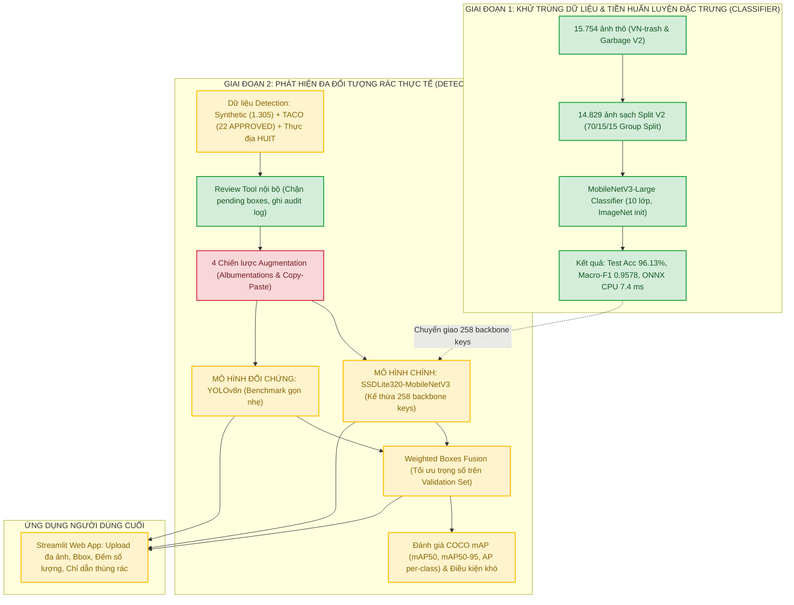

# HƯỚNG DẪN KIẾN TRÚC HỆ THỐNG VÀ LỘ TRÌNH TRIỂN KHAI TIẾP THEO
## DỰ ÁN: CNTT-KLCN155

> **Tên đề tài:** *Xây dựng hệ thống phát hiện và phân loại đa đối tượng rác thải sinh hoạt trong ảnh chụp thực tế bằng mô hình học sâu nhẹ và kỹ thuật tăng cường dữ liệu*  
> **Mã đề tài:** `CNTT-KLCN155`  
> **Nhóm thực hiện:** Nhóm nghiên cứu CNTT-KLCN155  
> **Mã nguồn:** [https://github.com/Nhan-create/CNTT-KLCN155-waste-detection](https://github.com/Nhan-create/CNTT-KLCN155-waste-detection)

---

## 1. TỔNG QUAN BÀI TOÁN VÀ BỐI CẢNH HỌC THUẬT

### 1.1. Phạm vi và Mục tiêu nghiên cứu
Hầu hết các nghiên cứu phân loại rác thải trước đây trên hai bộ dữ liệu phổ biến (`VN-trash` và `Garbage Classification V2`) chỉ giải quyết bài toán **Phân loại ảnh đơn nhãn (Single-Object Classification)** trên nền ảnh studio sạch sẽ, một vật thể đơn lẻ. Khi đưa vào bối cảnh thực tế (thùng rác công cộng, vỉa hè, căn tin trường học), các mô hình này bị sụt giảm nghiêm trọng độ chính xác do rác bị biến dạng, dính bẩn, che khuất và nằm chồng lấn nhiều loại rác trong cùng một khuôn hình.

Đề tài **`CNTT-KLCN155`** được thiết kế để giải quyết trọn vẹn bài toán **Phát hiện đa đối tượng (Multi-Object Detection)** trên ảnh tĩnh chụp thực tế:
- **Đầu vào:** Ảnh chụp rác thải thực tế có thể chứa đồng thời nhiều vật thể thuộc các chủng loại khác nhau.
- **Đầu ra hệ thống:**
  1. Tọa độ khung bao (Bounding Box: $x_1, y_1, x_2, y_2$) định vị chính xác từng vật thể rác.
  2. Tên nhãn lớp và độ tin cậy (Confidence score) của từng vật thể.
  3. Bảng thống kê số lượng vật thể theo từng nhóm rác.
  4. Hướng dẫn phân loại nguồn và quy định màu thùng rác tương ứng.
- **Phạm vi loại trừ:** Đề tài không thực hiện phân đoạn biên mặt nạ (Instance Segmentation), không điều khiển cánh tay robot và không xử lý luồng video camera thời gian thực tốc độ cao.

---

## 2. KIẾN TRÚC HỆ THỐNG HAI GIAI ĐOẠN (TWO-STAGE ARCHITECTURE)

Hệ thống được phát triển theo quy trình khoa học hai giai đoạn có tính kế thừa chặt chẽ:



### 2.1. Giai đoạn 1 — Tiền xử lý dữ liệu và Huấn luyện Classifier (ĐÃ HOÀN THÀNH)
- **Mục đích:** Xử lý triệt để bài toán rò rỉ dữ liệu nguồn, loại bỏ bản sao và huấn luyện mô hình tích chập nhẹ MobileNetV3-Large trên tập dữ liệu phân loại đơn rác lớn để tạo bộ trích xuất đặc trưng (feature extractor) chất lượng cao.
- **Kết quả đo đạc thực tế:**
  - Tổng số ảnh sạch: **14.829 ảnh** (loại bỏ 24.518 ảnh sao chép resize, 890 cặp trùng lặp liên nguồn MD5/pHash, và cách ly các mẫu xung đột nhãn).
  - Phân chia Split V2 chống rò rỉ (Atomic Group Split, seed 42): Train 10.383 ảnh (70,02%), Val 2.223 ảnh (14,99%), Test 2.223 ảnh (14,99% — **LOCKED**).
  - Hiệu năng trên tập Test độc lập: **Top-1 Accuracy đạt 96.13%**, **Macro-F1 đạt 0.9578**, Recall lớp pin nguy hại (`battery`) đạt **95.58%**.
  - Tối ưu hóa triển khai: Mô hình xuất sang định dạng ONNX FP32 đạt độ trễ suy luận **7.40 ms/ảnh** trên CPU laptop 6 luồng.

### 2.2. Giai đoạn 2 — Phát hiện đa đối tượng và Hợp nhất dự đoán (ĐANG TRIỂN KHAI)
- **Mô hình chính (Primary Model):** **SSDLite320-MobileNetV3**
  - Kế thừa 258/308 tensor keys đặc trưng từ backbone MobileNetV3 đã huấn luyện ở Giai đoạn 1.
  - Tối ưu hóa cho thiết bị biên với kích thước ảnh đầu vào $320 \times 320$, độ phức tạp tính toán thấp.
- **Mô hình đối chứng (Benchmark Model):** **YOLOv8n**
  - Kiến trúc một giai đoạn (Single-stage detector) hiện đại của Ultralytics, đóng vai trò mốc so sánh tiêu chuẩn về độ chính xác và tốc độ.
- **Kỹ thuật tăng cường dữ liệu mở rộng:**
  - Ứng dụng **Albumentations** biến đổi đồng bộ ảnh và bounding box (hình học, quang học, nhiễu, tương phản).
  - Ứng dụng **Copy-Paste Augmentation** ghép các vật thể rác có mặt nạ tiền cảnh lên phông nền bãi rác để tăng mật độ và mô phỏng che khuất.
- **Kỹ thuật hợp nhất dự đoán Weighted Boxes Fusion (WBF):**
  - Kết hợp bounding box từ SSDLite320 và YOLOv8n theo từng lớp rác, tính trọng số tọa độ dựa trên độ tin cậy.
  - Toàn bộ trọng số $w_{\text{SSD}}, w_{\text{YOLO}}$, ngưỡng IoU và ngưỡng confidence được lựa chọn bằng Grid Search **hoàn toàn trên tập Validation**, tuyệt đối không can thiệp vào tập Test.

---

## 3. HỆ THỐNG MƯỜI NHÓM RÁC THỐNG NHẤT (TAXONOMY 10 CLASSES)

Nhóm nghiên cứu và PM đã thống nhất mở rộng từ 6 nhóm truyền thống lên **10 nhóm rác chi tiết** nhằm phản ánh đúng thực tế thu gom rác thải đô thị Việt Nam:

| Class ID | Tên tiếng Anh | Tên tiếng Việt | Đặc điểm nhận dạng thực tế | Loại thùng rác đề xuất |
|:---:|:---|:---|:---|:---|
| **0** | `battery` | Pin nguy hại | Pin tiểu, pin cúc áo, ắc quy nhỏ | **Thùng Đỏ / Nguy hại** |
| **1** | `biological` | Rác hữu cơ | Vỏ trái cây, thức ăn thừa, lá cây | **Thùng Xanh lá / Hữu cơ** |
| **2** | `cardboard` | Bìa carton | Thùng carton sóng, vỏ hộp giấy cứng | **Thùng Vàng / Tái chế** |
| **3** | `clothes` | Vải / Quần áo cũ | Quần áo phế thải, giẻ lau, vải vụn | **Thùng Tái chế vải** |
| **4** | `glass` | Thủy tinh | Chai lọ thủy tinh, ly vỡ, bóng đèn | **Thùng Trắng / Tái chế** |
| **5** | `metal` | Kim loại | Vỏ lon bia/nước ngọt, nắp kim loại, đinh sắt | **Thùng Vàng / Tái chế** |
| **6** | `paper` | Giấy | Giấy vụn, hóa đơn, giấy báo, ly giấy | **Thùng Vàng / Tái chế** |
| **7** | `plastic` | Nhựa | Chai PET, túi ni lông, hộp xốp, cốc nhựa | **Thùng Vàng / Tái chế** |
| **8** | `shoes` | Giày dép phế thải | Giày cũ, dép xốp rách, quai hậu hỏng | **Thùng Tái chế / Khác** |
| **9** | `trash` | Rác vô cơ còn lại | Rác hỗn hợp không thể tái chế, tã lót | **Thùng Xám / Vô cơ** |

---

## 4. BẢNG HIỆN TRẠNG MÃ NGUỒN VÀ TÀI NGUYÊN (INVENTORY AUDIT)

| Hạng mục | Đường dẫn mã nguồn / Artifact | Trạng thái hiện tại |
|:---|:---|:---:|
| **Dữ liệu sạch Classification** | `data/processed_v2/` và `data/audit/split_manifest_v2.csv` | **VERIFIED (14.829 ảnh)** |
| **Trọng số Classifier chính thức** | `artifacts/official_run/best_model.pt` | **VERIFIED (Acc 96.13%)** |
| **Công cụ gán nhãn Review Tool** | `src/ui/review_tool.py` | **VERIFIED (Có chặn box pending)** |
| **Dữ liệu thật đã duyệt (TACO)** | `data/audit/real_detection_source_manifest.csv` | **VERIFIED (22 ảnh, 275 boxes)** |
| **Pipeline chia split Detection** | `scripts/build_detection_splits.py` | **VERIFIED (Chống rò rỉ group)** |
| **Code huấn luyện SSDLite320** | `src/detection/ssdlite_train.py` | **CODE READY (Chưa train detector)** |
| **Code huấn luyện YOLOv8n** | `src/detection/train.py` | **CODE READY (Chưa train detector)** |
| **Thuật toán WBF & Grid Search** | `src/detection/fusion.py` & `src/detection/tune.py` | **CODE READY (Chưa có weights)** |
| **Đánh giá COCO mAP Detection** | `src/detection/evaluate.py` | **CODE READY (Chưa có weights)** |
| **Giao diện Web Streamlit** | `streamlit_app.py` | **CODE READY (Giao diện hoàn chỉnh)** |
| **Code Augmentation Albumentations** | `src/detection/augmentation.py` | **CẦN TẠO MỚI** |
| **Ảnh rác thực tế TP.HCM / HUIT** | `data/real_collection/` | **CẦN THU THẬP BỔ SUNG** |

---

## 5. HƯỚNG DẪN CÀI ĐẶT VÀ VẬN HÀNH CỤC BỘ

### 5.1. Khởi tạo môi trường ảo Python 3.12
```powershell
# Di chuyển vào thư mục dự án
cd D:\CNTT-KLCN155-waste-detection

# Kích hoạt môi trường ảo sẵn có
.\.venv\Scripts\Activate.ps1

# Cài đặt hoặc cập nhật thư viện phụ thuộc
pip install -r requirements.txt
```

### 5.2. Khởi chạy Ứng dụng Web Streamlit
```powershell
# Chạy giao diện Web chính thức
streamlit run streamlit_app.py
```
- Mở trình duyệt tại: `http://localhost:8501`
- Tính năng: Hỗ trợ kéo thả đồng thời nhiều ảnh rác, lựa chọn backend suy luận (`ssdlite`, `yolov8n`, `wbf`), thanh slider điều chỉnh ngưỡng tin cậy (Confidence threshold), xem trực quan bounding box và tải kết quả đơn hoặc tải file zip tổng hợp.

### 5.3. Khởi chạy Công cụ Thẩm định Nhãn nội bộ (Review Tool)
```powershell
streamlit run src/ui/review_tool.py -- --manifest data/audit/real_detection_source_manifest.csv
```
- Tính năng: Kiểm tra trực quan từng ảnh và từng bounding box, gán nhãn lại, chuyển trạng thái `APPROVED` / `REJECTED`, tích hợp cơ chế chặn lưu phê duyệt nếu còn bounding box nghi vấn ở trạng thái `PENDING`.

---

## 6. LỘ TRÌNH CÁC VIỆC CẦN LÀM TIẾP THEO (ACTION PLAN)

Nhóm nghiên cứu triển khai theo 7 bước tuần tự có tiêu chí nghiệm thu rõ ràng:

### Bước 1: Gửi Tờ trình điều chỉnh đề cương cho Giảng viên hướng dẫn (GVHD)
- **Hành động:** Sử dụng bản dự thảo tại Mục 12 của tài liệu `docs/plan/PROPOSAL_ARCHITECTURE_ALIGNMENT_REVIEW.md` để trình bày với GVHD trong buổi gặp tuần này.
- **Nội dung chính:** Xin mở rộng taxonomy detection từ 6 nhóm lên 10 nhóm chi tiết để phù hợp công năng tái chế đô thị, và bổ sung nguồn ảnh TACO kết hợp Review Tool nội bộ.
- **Tiêu chí nghiệm thu:** Được GVHD thông qua định hướng (bằng email hoặc xác nhận trong sổ hướng dẫn).

### Bước 2: Đồng bộ Taxonomy 10 lớp trong toàn bộ Mã nguồn Detection
- **Hành động:**
  - Sửa `src/detection/schema.py`: đổi `DETECTION_CLASS_NAMES` thành 10 lớp chuẩn.
  - Sửa `src/detection/dataset.py`: cập nhật kiểm tra `nc must be ten`.
  - Sửa `src/detection/ssdlite.py`, `src/detection/yolo.py`, `src/detection/fusion.py`, `src/detection/evaluate.py`: mở rộng số lớp lên 10.
  - Sửa `streamlit_app.py`: hiển thị 10 nhóm rác tiếng Việt và bổ sung component hiển thị màu thùng rác tương ứng.
- **Tiêu chí nghiệm thu:** Toàn bộ test suite `pytest tests/` chạy PASS $100\%$, không còn lỗi lệch số lớp.

### Bước 3: Thu thập và duyệt nhãn bổ sung dữ liệu thực tế ngoài bãi rác
- **Hành động:**
  - Duyệt tiếp 103 ảnh TACO còn lại trong hàng đợi để lấy thêm mẫu thực tế.
  - Nhóm sinh viên tổ chức chụp bổ sung khoảng 50–100 ảnh rác thực tế ngoài bãi tập kết / khuôn viên thực địa (đặc biệt tập trung vào các lớp đang thiếu mẫu: quần áo cũ `clothes`, pin `battery`, giày dép cũ `shoes`).
  - Gán nhãn qua CVAT và thẩm định kiểm tra chéo bằng Review Tool nội bộ.
  - Chạy lại `scripts/build_detection_splits.py` để tạo tập Test thực tế độc lập có quy mô 30–50 ảnh.
- **Tiêu chí nghiệm thu:** Cả 10 lớp đều có mẫu trong tập Test; lớp `clothes` gỡ bỏ trạng thái `BLOCKED`.

### Bước 4: Lập trình Module Augmentation bằng Albumentations & Copy-Paste
- **Hành động:**
  - Tạo file `src/detection/augmentation.py`.
  - Cài đặt 4 biến thể dữ liệu offline:
    1. `none`: Giữ nguyên ảnh gốc.
    2. `geometric`: Phép lật, xoay, scale, cắt xén ngẫu nhiên có cập nhật bounding box.
    3. `photometric`: Biến đổi độ sáng, độ tương phản, Hue/Saturation, thêm nhiễu Gaussian và Motion Blur.
    4. `combined`: Kết hợp hình học, ánh sáng và kỹ thuật Copy-Paste vật thể rác lên nền mới.
- **Tiêu chí nghiệm thu:** Xuất ra 4 thư mục dữ liệu tương ứng có file YAML và nhãn bounding box chuẩn xác.

### Bước 5: Huấn luyện Ma trận Thí nghiệm 2 Models $\times$ 4 Augmentations
- **Hành động:**
  - Tích hợp cờ `--backbone-weights` trong `src/detection/ssdlite_train.py` để nạp 258 feature keys từ `artifacts/official_run/best_model.pt` sang SSDLite320.
  - Chạy 8 lượt huấn luyện trên card GPU NVIDIA RTX 2050 (hoặc Google Colab T4):
    + 4 biến thể cho SSDLite320-MobileNetV3 (Mô hình chính).
    + 4 biến thể cho YOLOv8n (Mô hình đối chứng).
- **Tiêu chí nghiệm thu:** 8 checkpoints tốt nhất được lưu tại `artifacts/detection/` kèm lịch sử loss và validation mAP qua từng epoch.

### Bước 6: Tối ưu hóa Weighted Boxes Fusion (WBF) và Đánh giá Ablation
- **Hành động:**
  - Chạy script `src/detection/tune.py` thực hiện Grid Search tìm bộ trọng số $w_{\text{SSD}}, w_{\text{YOLO}}$ và ngưỡng IoU tối ưu trên tập Validation.
  - Mở khóa tập Test độc lập (chỉ chạy duy nhất 1 lần) để đánh giá đối sánh công bằng: SSDLite vs YOLOv8n vs WBF Ensemble.
  - Đánh giá phân tách trên các nhóm điều kiện ảnh khó: thiếu sáng, ngược sáng, vật thể nhỏ, che khuất, chồng lấn.
  - Đo đạc thông lượng suy luận: Latency batch size 1 (ms), FPS, dung lượng mô hình (MB), mức tiêu thụ RAM/VRAM.
- **Tiêu chí nghiệm thu:** Bảng tổng hợp số liệu ablation đầy đủ đưa vào Chương 4 của Báo cáo khóa luận.

### Bước 7: Đóng gói Bàn giao, Hoàn thiện Báo cáo và Thiết kế Slide Bảo vệ
- **Hành động:**
  - Tích hợp weights tốt nhất vào ứng dụng Web Streamlit.
  - Viết toàn bộ Quyển báo cáo khóa luận theo chuẩn định dạng học thuật.
  - Thiết kế bài thuyết trình Slide PowerPoint báo cáo tốt nghiệp.
  - Rà soát mã nguồn, cấu hình, requirements và đẩy phiên bản phát hành cuối cùng lên GitHub.

---

## 7. LIÊN HỆ VÀ ĐÓNG GÓP

Dự án được quản lý tại kho lưu trữ GitHub chính thức:  
👉 **[https://github.com/Nhan-create/CNTT-KLCN155-waste-detection](https://github.com/Nhan-create/CNTT-KLCN155-waste-detection)**

Mọi ý kiến đóng góp hoặc thắc mắc kỹ thuật vui lòng tạo Issue trên GitHub Repository.
