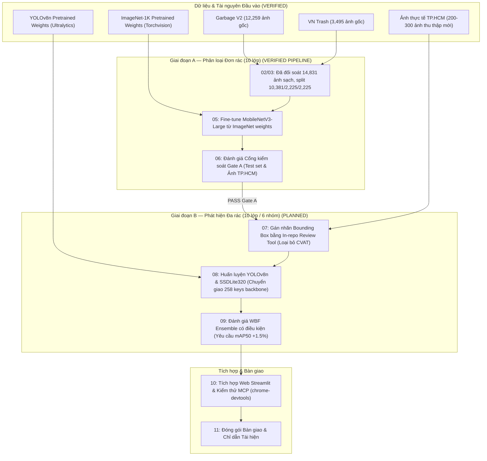

# 00 — MASTER PLAN: KẾ HOẠCH TỔNG THỂ DỰ ÁN PHÂN LOẠI VÀ PHÁT HIỆN RÁC THẢI (R2)

**Mã đề tài:** `CNTT-KLCN155`  
**Tên đề tài:** *Xây dựng hệ thống phát hiện và phân loại đa đối tượng rác thải sinh hoạt trong ảnh chụp thực tế bằng mô hình học sâu nhẹ và kỹ thuật tăng cường dữ liệu*  
**Chủ dự án (PM):** Ngô Thanh Nhân (HUIT)  
**Vai trò:** Tech Lead & Machine Learning Engineer  
**Phiên:** Task R2 — Reconcile, Audit & Rectify  
**Trạng thái kế hoạch:** `PLAN_READY` (Đã kiểm chứng dữ liệu, đối soát layer, cô lập workspace)

---

## 1. Mục tiêu và vấn đề cần giải quyết

### 1.1. Mục tiêu tổng thể
Xây dựng một hệ thống học sâu hoàn chỉnh, nhẹ, có khả năng chạy trên thiết bị phổ thông/biên và máy chủ web, nhằm tự động phát hiện và phân loại rác thải sinh hoạt theo ảnh chụp thực tế. Hệ thống phát triển qua hai giai đoạn khoa học chặt chẽ:
- **Giai đoạn A (Single-Object Classification):** Phân loại rác đơn thể 10 lớp bằng mạng tích chập nhẹ MobileNetV3-Large (F1 đạt 0.9559), làm cơ sở chuẩn bị đặc trưng backbone và đối sánh.
- **Giai đoạn B (Multi-Object Detection - CHỐT THEO ĐỀ CƯƠNG):** Phát hiện và phân loại đa đối tượng rác thải theo đúng 6 nhóm chuẩn của đề cương (`plastic`, `paper`, `metal`, `glass`, `organic`, `hazardous`). Sử dụng **SSDLite320-MobileNetV3 làm mô hình CHÍNH** (kế thừa 258 tầng backbone từ bộ phân loại), **YOLOv8n làm mô hình ĐỐI CHỨNG**, kết hợp kỹ thuật tăng cường dữ liệu Albumentations + Copy-Paste và Weighted Boxes Fusion (WBF).

### 1.2. Quyết định định hướng của PM (Binding Decision)
- **Taxonomy:** Tuân thủ 100% đề cương chính thức: chuẩn hóa 6 lớp rác phục vụ phân loại tại nguồn (`Nhựa`, `Giấy/bìa`, `Kim loại`, `Thủy tinh`, `Hữu cơ`, `Nguy hại`). Loại trừ hoàn toàn `clothes`, `shoes`, `trash` khỏi tập detection (không mở rộng 10 lớp đơn phương).
- **Mô hình:** Khôi phục đúng vị trí đề cương: **SSDLite320-MobileNetV3 là mô hình CHÍNH**, **YOLOv8n là mô hình ĐỐI CHỨNG**.
- **Kỹ thuật:** Triển khai nạp trực tiếp 258 tensor đặc trưng từ `best_model.pt` của bộ phân loại sang backbone SSDLite320. Sử dụng WBF để hợp nhất dự đoán và khảo sát trên tập Validation.
1. **Khoảng cách giữa dữ liệu phòng thí nghiệm và thực tế:** Hai tập dữ liệu Kaggle hiện có (`VN Trash` và `Garbage Classification V2`) là ảnh studio đơn rác, nền sạch. Khi đưa vào bối cảnh thực tế (thùng rác công cộng, lòng đường, căn tin), mô hình bị sụt giảm độ chính xác do rác bị dính bẩn, biến dạng, che khuất một phần và nằm chồng lấn.
2. **Nghịch lý chuyển giao kiến trúc:** Phân loại ảnh (Classification) không tự động định vị được vật thể (Detection) khi có nhiều rác trong một ảnh. Cần chuyển giao đặc trưng backbone một cách hợp lý và huấn luyện đầu dò detection chuyên biệt (với 168 keys tensor mới).
3. **Tính trung thực khoa học và chống rò rỉ dữ liệu:** Đảm bảo 100% không rò rỉ dữ liệu giữa train/val/test do các góc chụp gần trùng; không dùng nhãn giả định (pseudo-label) để ngụy tạo độ chính xác thực tế; cố định tập test độc lập. Khắc phục nguy cơ pretraining overlap từ các checkpoint công khai như Ecovision bằng cách dùng ImageNet-1K chuẩn làm điểm bắt đầu huấn luyện chính thức.

---

## 2. Hiện trạng đã xác minh (`VERIFIED`)

1. **Kho lưu trữ và đường dẫn (`VERIFIED`):**
   - Thư mục hoạt động độc lập: [D:\CNTT-KLCN155-waste-detection](file:///D:/CNTT-KLCN155-waste-detection) (đã gỡ bỏ Junction, khởi tạo Git repository riêng biệt, nhánh `main`, môi trường ảo Python 3.12 riêng tại `.venv`).
   - Thư mục dự án cũ: `C:\Users\ad\Downloads\Do-an-deeplearning\waste-classifier-mobilenetv3` được bảo toàn nguyên vẹn, không bị xóa hay sửa đổi.
2. **Dữ liệu thô và đã xử lý (`VERIFIED`):**
   - Dữ liệu thô tại `D:\HK7\Đồ án khóa luận\Data\`: gồm `raw/garbage_v2` (12.259 ảnh gốc) và `raw/vn_trash` (3.495 ảnh gốc). Tổng: **15.754** ảnh thô.
   - Loại trừ 24.518 ảnh sao chép resize (`standardized_256`: 12.259, `standardized_384`: 12.259).
   - Khử trùng chính xác 923 ảnh trùng lặp (897 MD5 exact match, 26 pHash near match). Trong đó: **890 cặp trùng liên nguồn** giữa `garbage_v2` và `vn_trash` (gồm 879 cặp trùng tuyệt đối MD5) và 33 cặp trùng nội bộ `vn_trash`.
   - Cách ly 2 mẫu xung đột nhãn (`cardboard` vs `paper` ở Cặp 10) tại `data/audit/quarantined_samples.csv`.
   - **Tập dữ liệu sạch Split V2 (Đã triệt tiêu rò rỉ):** Gồm chính xác **14.829** ảnh độc lập, phân chia theo cụm nguyên tử (Stratified Group Split, seed 42) tại `data/processed_v2/` và manifest `data/audit/split_manifest_v2.csv`:
     - **Train:** **10.383** ảnh ($70,02\%$)
     - **Val:** **2.223** ảnh ($14,99\%$)
     - **Test:** **2.223** ảnh ($14,99\%$) — **KHÓA CHẶT TUYỆT ĐỐI**
     - Tổng: $10.383 + 2.223 + 2.223 = \mathbf{14.829}$ ảnh sạch ($100\%$ không rò rỉ cụm, không rò rỉ SHA-256).
   - Nếu loại 3 lớp `clothes` (1.892) + `shoes` (1.449) + `trash` (503) = 3.844 ảnh $\rightarrow$ còn lại chính xác **10.985** ảnh sạch trong Split V2.
3. **Dữ liệu bounding box đa vật thể (`VERIFIED`):**
   - `data/detection/v1` gồm 1.419 ảnh và 4.602 bounding boxes.
   - **1.305 ảnh (91,97%)** là ảnh tổng hợp (Mendeley Synthetic) và chỉ có **114 ảnh (8,03%)** từ OpenImages. Tập này được cô lập chỉ dùng cho pretraining đa vật thể, không dùng làm test set thực tế.
4. **Trọng số mô hình hiện có (`VERIFIED`):**
   - [artifacts/ecovision/best.pt](file:///D:/CNTT-KLCN155-waste-detection/artifacts/ecovision/best.pt): Checkpoint MobileNetV3-Large 10 lớp được gán tag `PRETRAINING_OVERLAP_UNKNOWN`. Được giữ lại làm baseline tham chiếu ngoại bộ, đánh giá trên VN Trash và ảnh thực tế TP.HCM.
   - [weights/yolo26n.pt](file:///D:/CNTT-KLCN155-waste-detection/weights/yolo26n.pt): Bóc tách checkpoint xác nhận là mô hình COCO 80 lớp (`tune-yolo26n-objv1-coco`), không phải mô hình rác. Huấn luyện đa rác sẽ chạy mới trên tập dữ liệu rác từ nền tảng YOLOv8n.
5. **Môi trường phần cứng (`VERIFIED`):**
   - CPU AMD Ryzen 5 6600H (6 cores, 12 threads), RAM 16 GB, GPU NVIDIA GeForce RTX 2050 (4 GB VRAM), Driver 591.86, CUDA 13.1.

---

## 3. Sơ đồ luồng kế hoạch (Data & Pipeline Workflow)



---

## 4. Đầu ra cụ thể của kế hoạch (Deliverables)

1. **Bộ tài liệu kế hoạch và đối soát (15 tệp Markdown):** Trong thư mục [docs/plan/](file:///D:/CNTT-KLCN155-waste-detection/docs/plan), kèm file tự phản biện [R2_REVIEW.md](file:///D:/CNTT-KLCN155-waste-detection/docs/plan/R2_REVIEW.md) và biên bản kiểm kê [data/audit/](file:///D:/CNTT-KLCN155-waste-detection/data/audit).
2. **Giai đoạn A:**
   - Checkpoint `artifacts/run-001/best.pt` mô hình MobileNetV3 10 lớp được fine-tune từ ImageNet-1K trên 10.381 ảnh train.
   - Bảng metrics chi tiết (Top-1 Accuracy $\ge 0.88$, Macro-F1 $\ge 0.85$, Recall $\ge 0.80$, Battery Recall $\ge 0.88$).
   - Ma trận nhầm lẫn `confusion_matrix_stage_a.png` và danh sách mẫu phân loại sai.
   - Baseline đối chứng với Ecovision trên VN Trash.
3. **Giai đoạn B:**
   - Dataset đa rác chuẩn YOLO format tại `data/detection/v2-waste/` với nhãn được gán/thẩm định bằng in-repo review tool, tách riêng tập synthetic và tập real-world.
   - Checkpoints: `artifacts/detection/yolov8n-waste/weights/best.pt` và `artifacts/detection/ssdlite320-waste/weights/best.pth`.
   - Kết quả Grid Search WBF: tệp cấu hình [configs/detection_fusion.yaml](file:///D:/CNTT-KLCN155-waste-detection/configs/detection_fusion.yaml) chứa trọng số tối ưu $w_{\text{YOLO}}, w_{\text{SSD}}$ trên tập Validation.
   - Báo cáo so sánh 3 chế độ: YOLOv8n vs SSDLite320 vs WBF (mAP50, mAP50-95, latency, FPS).
4. **Sản phẩm ứng dụng:**
   - Ứng dụng Web Streamlit [streamlit_app.py](file:///D:/CNTT-KLCN155-waste-detection/streamlit_app.py) hỗ trợ cả 2 chế độ: Đơn rác (Classification) và Đa rác (Detection).
   - Công cụ kiểm tra và thẩm định bounding box nội bộ [src/ui/review_tool.py](file:///D:/CNTT-KLCN155-waste-detection/src/ui/review_tool.py).

---

## 5. Danh sách tệp cần tạo và sửa đổi trong repo

| Tệp | Trạng thái | Mục đích |
|:---|:---:|:---|
| [docs/plan/*.md](file:///D:/CNTT-KLCN155-waste-detection/docs/plan) | `VERIFIED` | 15 tài liệu kế hoạch, phản biện và đối soát hoàn chỉnh |
| [data/audit/*](file:///D:/CNTT-KLCN155-waste-detection/data/audit) | `VERIFIED` | 6 tệp log và CSV kiểm toán dữ liệu và chuyển giao backbone |
| [configs/train_stage_a.yaml](file:///D:/CNTT-KLCN155-waste-detection/configs/train_stage_a.yaml) | `PROPOSED` | Cấu hình huấn luyện MobileNetV3 10 lớp khởi tạo từ ImageNet |
| [configs/detection_training.yaml](file:///D:/CNTT-KLCN155-waste-detection/configs/detection_training.yaml) | `PROPOSED` | Cấu hình huấn luyện YOLOv8n và SSDLite320 trên dữ liệu rác |
| [src/ui/review_tool.py](file:///D:/CNTT-KLCN155-waste-detection/src/ui/review_tool.py) | `PROPOSED` | Công cụ Streamlit nội bộ để review/thẩm định nhãn bounding box |
| [streamlit_app.py](file:///D:/CNTT-KLCN155-waste-detection/streamlit_app.py) | `PROPOSED` | Ứng dụng Web chính thức cho người dùng cuối |

---

## 6. Lộ trình thực hiện 5 chặng (Phased Timeline)

```
Chặng 1: Thiết lập Pipeline Tiền xử lý, Khởi tạo ImageNet Weights & Huấn luyện MobileNetV3 10 lớp (Giai đoạn A)
Chặng 2: Đánh giá Cổng Gate A trên Test Set độc lập & Thẩm định Bounding Box Đa rác bằng Review Tool
Chặng 3: Huấn luyện YOLOv8n (Chính) & SSDLite320 (Đối chứng với 258 backbone keys chuyển giao) (Giai đoạn B)
Chặng 4: Thực nghiệm Ablation, Grid Search WBF Ensemble có điều kiện & Phân tích ca lỗi thực tế
Chặng 5: Hoàn thiện Web Streamlit, Kiểm thử E2E bằng MCP chrome-devtools & Đóng gói Bàn giao
```

---

## 7. Cấu hình ban đầu và lý do lựa chọn

| Tham số | Giai đoạn A (Classification) | Giai đoạn B (Detection) | Cơ sở kỹ thuật |
|:---|:---|:---|:---|
| **Mô hình** | MobileNetV3-Large (ImageNet init) | YOLOv8n + SSDLite320 | Nhẹ, tối ưu cho máy tính nhúng và laptop cá nhân |
| **Kích thước ảnh** | $224 \times 224$ px | $640 \times 640$ (YOLO), $320 \times 320$ (SSD) | Chuẩn tối ưu của từng kiến trúc theo tài liệu gốc |
| **Batch size** | 32 | 16 (YOLO), 16 (SSDLite) | Phù hợp trần bộ nhớ 4 GB VRAM của card RTX 2050 |
| **Optimizer** | AdamW ($lr=5e-4$, weight decay=1e-2) | SGD ($lr=0.01$, momentum=0.937) | Phù hợp transfer learning CNN và bộ giải YOLO |
| **Epochs / Patience**| 50 epochs / EarlyStop 10 | 50 epochs / EarlyStop 10 | Tránh lãng phí tính toán khi loss trên Val bão hòa |
| **Precision** | AMP fp16 | AMP fp16 | Tăng tốc độ tính toán gấp đôi và tiết kiệm 40% VRAM |

---

## 8. Tiêu chí nghiệm thu đo được (Acceptance Gates)

### 8.1. Cổng chuyển giai đoạn (Gate A: Chuyển từ Đơn rác sang Đa rác)
Đạt toàn bộ tiêu chí trên tập Test độc lập (2.225 ảnh) và tập kiểm thử VN Trash:
- **Top-1 Accuracy:** $\ge 88.0\%$
- **Macro-F1 Score:** $\ge 0.850$
- **Recall tối thiểu từng lớp:** $\ge 0.800$
- **Recall riêng lớp nguy hại (`battery`):** $\ge 0.880$ (không được phép bỏ sót)
- **Data Leakage Check:** $\text{Zero Duplicate} = \text{True}$ (đã xác thực bằng SHA-256 hash và pHash).

### 8.2. Cổng nghiệm thu cuối cùng (Gate B: Nghiệm thu Giai đoạn B)
Đánh giá trên tập Benchmark Test Set đa rác thực tế:
- **mAP@0.5 (YOLOv8n):** $\ge 0.700$
- **mAP@0.5:0.95 (YOLOv8n):** $\ge 0.450$
- **Độ trễ suy luận toàn luồng (Batch size 1):** $< 35\text{ ms/ảnh}$ trên GPU RTX 2050 ($> 28\text{ FPS}$).
- **Điều kiện WBF:** Chỉ kích hoạt nếu $\text{mAP50}_{\text{WBF}} \ge \max(\text{mAP50}_{\text{YOLO}}, \text{mAP50}_{\text{SSD}}) + 0.015$ và độ trễ $\le 60\text{ ms}$.
- **Giao diện Web:** 100% ca kiểm thử trong tài liệu `10_WEB_INTEGRATION_AND_MCP_TESTS.md` phải PASS.

---

## 9. Task tiếp theo sẵn sàng triển khai (Immediate Next Task)

Khi PM phê duyệt tài liệu R2, dự án sẽ tiến hành ngay:
> **TASK 01:** Thiết lập Pipeline Tiền Xử Lý Dữ Liệu và Huấn Luyện Thử Nghiệm Baseline Giai Đoạn A (Cài đặt PyTorch CUDA cho card RTX 2050, xác thực nạp 14.831 ảnh sạch từ `Data/processed`, khởi tạo MobileNetV3-Large từ ImageNet-1K, và chạy 5 epochs smoke-test kiểm tra hội tụ).
