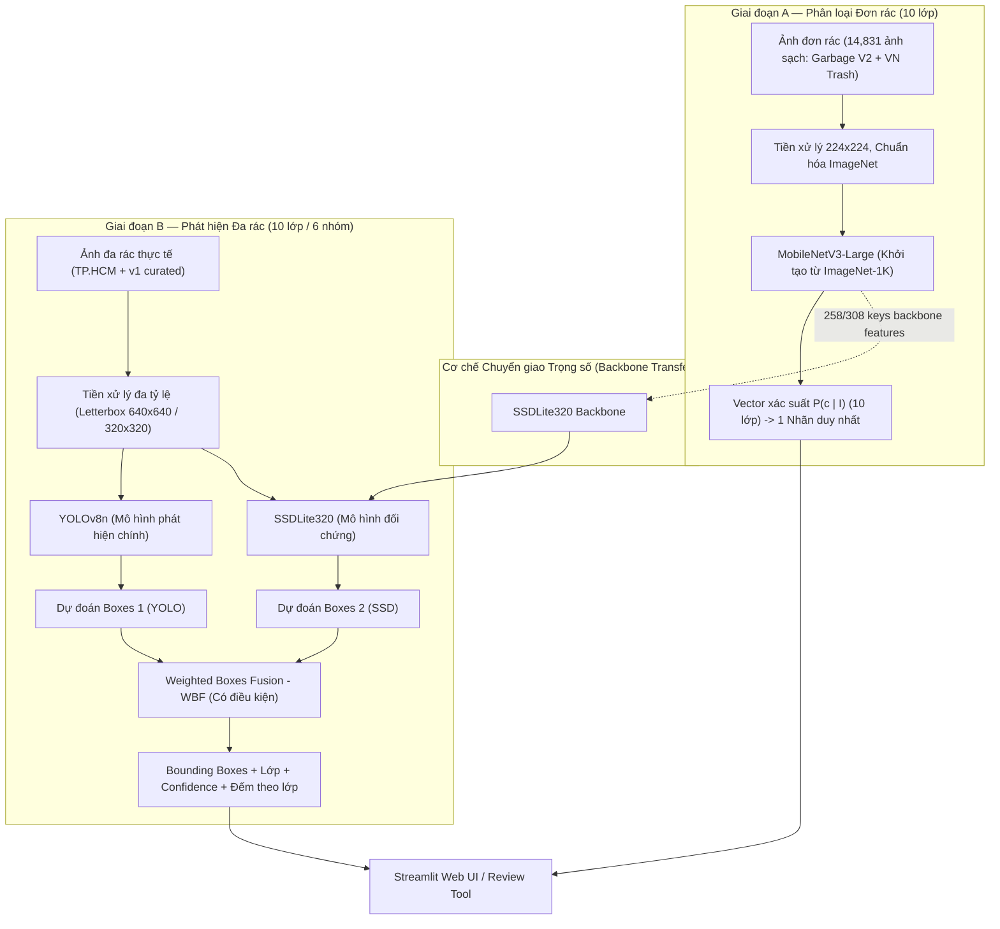

# 01 — CURRENT STATE AND ARCHITECTURE: HIỆN TRẠNG VÀ KIẾN TRÚC HỆ THỐNG (R2)

**Dự án:** Phân loại và phát hiện rác thải sinh hoạt (`CNTT-KLCN155`)  
**Tác giả:** Tech Lead & Machine Learning Engineer  
**Phiên:** Task R2 — Reconcile, Audit & Rectify  
**Trạng thái:** `VERIFIED_AND_LOCKED` (Đã kiểm toán thực tế và đối soát layer)

---

## 1. Mục tiêu và vấn đề cần giải quyết

### 1.1. Mục tiêu
Xác lập hồ sơ kỹ thuật chính xác 100% về hiện trạng kho lưu trữ mã nguồn, tính độc lập của workspace, các module chức năng, trọng số và dữ liệu hiện hữu; đồng thời làm rõ về mặt lý thuyết và thực nghiệm các quyết định kiến trúc: vai trò của MobileNetV3 (Classifier), MobileNetV3 trong SSDLite (Backbone Feature Extractor), YOLOv8n (One-stage Detector), và giải thích triệt để vì sao mô hình phân loại không thể tự động trở thành mô hình phát hiện khi đưa ảnh nhiều rác vào.

### 1.2. Vấn đề cần giải quyết
1. **Giải quyết vấn đề Junction và thiết lập workspace độc lập (`VERIFIED`):** Gỡ bỏ hoàn toàn liên kết Junction `D:\CNTT-KLCN155-waste-detection` trỏ vào repo cũ `C:\Users\ad\Downloads\Do-an-deeplearning\waste-classifier-mobilenetv3`. Thiết lập thư mục vật lý độc lập mới có Git repo riêng, `.venv` riêng, bảo toàn 100% repo cũ.
2. **Thống nhất taxonomy 10 lớp (`VERIFIED`):** Đặt 10 lớp làm chuẩn kiến trúc cho cả hai giai đoạn, lập bảng ánh xạ 10 lớp $\leftrightarrow$ 6 lớp của đề cương cũ để đối chiếu khi cần.
3. **Hiểu lầm về tái sử dụng mô hình (`VERIFIED`):** Chứng minh bằng cấu trúc tensor thực tế rằng classifier không thể nạp thẳng vào detector; bóc tách checkpoint `yolo26n.pt` chứng minh đây là COCO model chứ không phải mô hình rác; phân tích nguy cơ data contamination từ checkpoint `Ecovision`.

---

## 2. Hiện trạng đã xác minh (`VERIFIED`)

### 2.1. Thư mục và cấu hình Git
- **Workspace hoạt động chính thức (`VERIFIED`):** [D:\CNTT-KLCN155-waste-detection](file:///D:/CNTT-KLCN155-waste-detection) (Thư mục vật lý độc lập, không phải Reparse Point hay Junction).
- **Git Repo mới:** `git init -b main` tại `D:\CNTT-KLCN155-waste-detection`.
- **Môi trường ảo mới:** `D:\CNTT-KLCN155-waste-detection\.venv` (Python 3.12.10, cài đặt pillow, pandas, pyyaml, numpy độc lập).
- **Bảo toàn kho cũ:** `C:\Users\ad\Downloads\Do-an-deeplearning\waste-classifier-mobilenetv3` được giữ nguyên trạng, không bị chỉnh sửa thêm qua Junction.
- **Thư mục dữ liệu:** `D:\HK7\Đồ án khóa luận\Data` (gồm `raw/` và `processed/`).

### 2.2. Kiểm kê các module mã nguồn hiện có
1. **Tiền xử lý và Dữ liệu:**
   - [src/preprocessing/merge_datasets.py](file:///D:/CNTT-KLCN155-waste-detection/src/preprocessing/merge_datasets.py): Gộp nguồn với provenance SHA-256.
   - [src/preprocessing/clean_data.py](file:///D:/CNTT-KLCN155-waste-detection/src/preprocessing/clean_data.py) & [src/data/dedup.py](file:///D:/CNTT-KLCN155-waste-detection/src/data/dedup.py): Khử trùng lặp ảnh bằng SHA-256 và pHash qua chỉ mục BK-Tree.
   - [src/data/split.py](file:///D:/CNTT-KLCN155-waste-detection/src/data/split.py): Chia cụm cluster 70/15/15 chống rò rỉ dữ liệu.
   - [src/data/validation.py](file:///D:/CNTT-KLCN155-waste-detection/src/data/validation.py): Cổng kiểm tra tính hợp lệ và zero-leakage trước khi huấn luyện.
2. **Huấn luyện và Đánh giá Phân loại (Giai đoạn A):**
   - [src/models/mobilenet.py](file:///D:/CNTT-KLCN155-waste-detection/src/models/mobilenet.py): Định nghĩa kiến trúc MobileNetV3-Large với đầu phân loại 10 lớp.
   - [src/training/train.py](file:///D:/CNTT-KLCN155-waste-detection/src/training/train.py) & [src/training/engine.py](file:///D:/CNTT-KLCN155-waste-detection/src/training/engine.py): Vòng lặp huấn luyện PyTorch với AMP fp16, Cosine Annealing, early stopping.
   - [src/evaluation/evaluate.py](file:///D:/CNTT-KLCN155-waste-detection/src/evaluation/evaluate.py): Xuất báo cáo Precision, Recall, Macro-F1, Confusion Matrix.
3. **Huấn luyện và Đánh giá Phát hiện (Giai đoạn B):**
   - [src/detection/yolo.py](file:///D:/CNTT-KLCN155-waste-detection/src/detection/yolo.py): Adapter giao tiếp với Ultralytics YOLOv8.
   - [src/detection/ssdlite.py](file:///D:/CNTT-KLCN155-waste-detection/src/detection/ssdlite.py) & [src/detection/ssdlite_train.py](file:///D:/CNTT-KLCN155-waste-detection/src/detection/ssdlite_train.py): Cài đặt SSDLite320-MobileNetV3 từ Torchvision.
   - [src/detection/fusion.py](file:///D:/CNTT-KLCN155-waste-detection/src/detection/fusion.py): Thuật toán Weighted Boxes Fusion kết hợp kết quả.
   - [src/detection/tune.py](file:///D:/CNTT-KLCN155-waste-detection/src/detection/tune.py): Grid Search tìm trọng số $w_{\text{YOLO}}, w_{\text{SSD}}$ tối ưu trên tập Validation.
   - [src/detection/evaluate.py](file:///D:/CNTT-KLCN155-waste-detection/src/detection/evaluate.py): Tính mAP COCO chuẩn qua `pycocotools`.
4. **Giao diện người dùng và công cụ thẩm định:**
   - [streamlit_app.py](file:///D:/CNTT-KLCN155-waste-detection/streamlit_app.py): Ứng dụng Web hoàn chỉnh, nhận diện đa ảnh, bảng thống kê nhóm rác, đo độ trễ và xuất ảnh.
   - [src/ui/review_tool.py](file:///D:/CNTT-KLCN155-waste-detection/src/ui/review_tool.py): Công cụ Streamlit nội bộ nhẹ phục vụ kiểm định và gán nhãn bounding box (thay thế CVAT).

### 2.3. Kiểm kê trọng số Checkpoint (`VERIFIED`)
- [artifacts/ecovision/best.pt](file:///D:/CNTT-KLCN155-waste-detection/artifacts/ecovision/best.pt): Checkpoint Torchvision MobileNetV3-Large 10 lớp (MIT License, nguồn HuggingFace `AmadFR/ecovision_mobilenetv3`). Trạng thái: `PRETRAINING_OVERLAP_UNKNOWN`. Dùng làm baseline đối chứng ngoại bộ, không dùng làm checkpoint huấn luyện chính thức để tránh nguy cơ rò rỉ tập test Garbage V2. Huấn luyện chính thức sẽ bắt đầu từ ImageNet-1K chuẩn (`weights='DEFAULT'`).
- [weights/yolo26n.pt](file:///D:/CNTT-KLCN155-waste-detection/weights/yolo26n.pt) & `yolo26n.pt`: Bóc tách metadata xác nhận đây là mô hình COCO 80 lớp (`tune-yolo26n-objv1-coco`), không phải mô hình rác. Huấn luyện đa rác phải chạy mới hoàn toàn trên dữ liệu rác.
- Thư mục trọng số phát hiện đã huấn luyện: `artifacts/detection/` hiện đang rỗng (chờ huấn luyện Giai đoạn B).

---

## 3. Sơ đồ kiến trúc luồng dữ liệu hai giai đoạn



---

## 4. Giải thích chuyên sâu 6 câu hỏi kiến trúc nền tảng

### 4.1. MobileNetV3 Classifier làm nhiệm vụ gì?
- **Bản chất kỹ thuật:** Là một mạng nơ-ron tích chập phân loại hình ảnh (Image Classification Network).
- **Cơ chế hoạt động:** Nhận đầu vào là toàn bộ bức ảnh $I \in \mathbb{R}^{H \times W \times 3}$ (mặc định $224 \times 224 \times 3$), đưa qua 16 khối Inverted Residual Bottleneck (Depthwise Separable Convolutions, Squeeze-and-Excitation, Hard-Swish). Tại cuối mạng, áp dụng phép gộp trung bình toàn cục (Global Average Pooling - GAP) để nén toàn bộ không gian đặc trưng về một vector $1 \times 960$. Vector này đi qua lớp Fully Connected (Linear) để xuất ra phân bố xác suất $P(y = c \mid I)$ trên 10 lớp rác.
- **Phạm vi áp dụng:** Chuyên trị các bức ảnh **chứa đúng một vật thể mục tiêu** (hoặc vật thể chiếm trọn khung hình). Trả về đúng 1 nhãn lớp duy nhất và độ tin cậy.

### 4.2. MobileNetV3 trong SSDLite làm nhiệm vụ gì?
- **Bản chất kỹ thuật:** Đóng vai trò là **Mạng xương sống trích xuất đặc trưng (Backbone Feature Extractor)** trong kiến trúc SSDLite (Single Shot MultiBox Detector Lite).
- **Cơ chế hoạt động:** SSDLite lược bỏ toàn bộ phần Classification Head và GAP của MobileNetV3. SSDLite chỉ giữ lại phần trích xuất đặc trưng tích chập và trích xuất các bản đồ đặc trưng (Feature Maps) ở nhiều tầng tỷ lệ khác nhau (ví dụ: $C_4$ kích thước $20 \times 20$ và $C_5$ kích thước $10 \times 10$). Các feature map này được nối vào các nhánh tích chập nhẹ (Lite Extra Layers) để cấp đầu vào cho các đầu dò phát hiện (Detection Heads), dự đoán độ lệch tọa độ hộp bao ($dx, dy, dw, dh$) và điểm số lớp tại các vị trí neo (anchor boxes).

### 4.3. YOLOv8n Detector làm nhiệm vụ gì?
- **Bản chất kỹ thuật:** Là một bộ phát hiện đối tượng đơn giai đoạn không dùng điểm neo (One-Stage Anchor-Free Object Detector) hiện đại.
- **Cơ chế hoạt động:** Gồm 3 thành phần liên kết chặt chẽ:
  1. *Backbone (Modified CSPDarknet):* Trích xuất đặc trưng hình ảnh ở các độ phân giải $P_3, P_4, P_5$.
  2. *Neck (Path Aggregation Network - PANet / C2f):* Hòa trộn và truyền tải thông tin ngữ cảnh từ trên xuống và từ dưới lên giữa các mức đặc trưng.
  3. *Decoupled Head:* Tách rời hoàn toàn nhánh dự đoán tọa độ hộp bao ($x, y, w, h$) thông qua hàm tổn thất DFL + CIoU Loss, và nhánh dự đoán lớp phân loại thông qua BCE Loss.
- **Phạm vi áp dụng:** Cùng lúc định vị tọa độ và phân loại **nhiều vật thể rác khác nhau** ở các kích thước và vị trí ngẫu nhiên trên một ảnh duy nhất ($640 \times 640$), giải quyết triệt để bài toán đếm và phân loại rác lẫn lộn.

### 4.4. Dữ liệu và thành phần nào có thể tái sử dụng từ Đơn rác sang Đa rác?
- **Thành phần có thể tái sử dụng:**
  1. *Trọng số tầng tích chập của Backbone (Features):* Các bộ lọc trích xuất cạnh, góc, vân bề mặt vật liệu học được từ phân loại đơn rác có thể chuyển giao 258/308 keys sang backbone của SSDLite320 (chi tiết Mục 5).
  2. *Dữ liệu vật thể tiền cảnh (Foreground Cutouts):* Các ảnh đơn rác có nhãn sạch dùng để tách nền vật thể, phục vụ kỹ thuật **Copy-Paste Augmentation** (ghép vật thể rác vào các bối cảnh nền đường phố/thùng rác).
  3. *Từ điển nhãn và Taxonomy (10 lớp):* Bộ từ điển định nghĩa vật liệu và quy tắc gán nhãn được kế thừa 100%.
  4. *Module tiền xử lý ảnh và validator:* Thuật toán đọc ảnh, xoay EXIF, chuẩn hóa màu sắc và thuật toán băm pHash chống rò rỉ dữ liệu.

### 4.5. Thành phần nào bắt buộc phải huấn luyện mới?
- **Bắt buộc phải huấn luyện mới:**
  1. *Toàn bộ Detection Heads (Đầu dò tọa độ và nhãn):* Do phân loại đơn rác không có tọa độ không gian, các tầng tích chập dự đoán bounding box (96 keys trong SSDLite) bắt buộc phải được khởi tạo ngẫu nhiên và huấn luyện từ đầu trên dữ liệu bounding box.
  2. *Extra Feature Pyramid Layers (72 keys trong SSDLite) & Feature Fusion Neck (C2f/PANet trong YOLOv8n):* Các mạng đa tỷ lệ này chưa từng tồn tại trong classifier.
  3. *Mô hình YOLOv8n:* Toàn bộ mô hình detector đa lớp phải được huấn luyện trên dữ liệu bounding box rác.
  4. *Trọng số hợp nhất WBF:* Bắt buộc chạy Grid Search mới để tìm bộ trọng số $w_{\text{YOLO}}, w_{\text{SSD}}$ tối ưu trên tập Validation của bài toán phát hiện.

### 4.6. Vì sao Classifier KHÔNG THỂ tự trở thành Detector khi đưa ảnh nhiều rác vào?
Có 3 nguyên nhân bản chất về mặt kiến trúc toán học và học máy:
1. **Phép gộp toàn cục (Global Average Pooling - GAP) làm mất hoàn toàn thông tin tọa độ không gian:** Khi đi qua lớp GAP, một feature map kích thước $C \times H \times W$ bị nén thành một vector $C \times 1 \times 1$ bằng cách lấy trung bình cộng tất cả các vị trí pixel:
   $$v_c = \frac{1}{H \times W} \sum_{i=1}^H \sum_{j=1}^W F_c(i, j)$$
   Mọi thông tin về việc *"vật thể nằm ở góc trên bên trái hay góc dưới bên phải"* bị xóa sạch hoàn toàn.
2. **Nhiễu loạn tín hiệu do hòa trộn đặc trưng (Feature Dilution & Confusion):** Nếu ảnh chứa đồng thời một chai nhựa, một lon nhôm và một vỏ hộp sữa, vector đặc trưng sau GAP sẽ là sự pha trộn hỗn độn của cả 3 vật liệu cùng với nền gạch/đất. Mô hình classifier chỉ có thể dự đoán một phân bố xác suất duy nhất; kết quả thường là dự đoán nhãn có diện tích lớn nhất hoặc dự đoán sai thành một lớp hoàn toàn khác do xung đột vector.
3. **Không có cơ chế đề xuất vùng (Region Proposal / Anchor Mechanism):** Classifier không có các nhánh tích chập chuyên biệt để quét các cửa sổ trượt hoặc dự đoán tâm đối tượng và độ lệch kích thước ($dx, dy, dw, dh$). Do đó, classifier về mặt toán học không có đầu ra nào chứa tọa độ bounding box để có thể phân tách và đếm số lượng vật thể.

---

## 5. Đối soát chi tiết Layer-by-Layer giữa Classifier và SSDLite320 (`VERIFIED`)

Kết quả đối soát thực tế được lưu tại [data/audit/backbone_transfer_audit.json](file:///D:/CNTT-KLCN155-waste-detection/data/audit/backbone_transfer_audit.json):

```
Tổng số tham số:
- MobileNetV3 Classifier: 312 keys (Features: 308 keys, Classifier: 4 keys)
- SSDLite320 Detector:    476 keys (Features: 308 keys, Extra Layers: 72 keys, Heads: 96 keys)

Chi tiết chuyển giao:
- Khớp hoàn toàn (Matched Keys):           258 / 308 keys (83.8% backbone features)
- Lệch projection trong backbone SSDLite:   50 keys
- Loại bỏ (Classifier Head):                4 keys (classifier.0, classifier.3)
- Bắt buộc khởi tạo và huấn luyện mới:     168 keys (Extra Pyramid: 72 keys + Detection Heads: 96 keys)
```

- **Quy tắc thực thi:** Khi chuyển giao từ `best.pt` của Giai đoạn A sang SSDLite320:
  Chỉ nạp 258 keys khớp chính xác về tên và shape. Toàn bộ 168 keys của Extra Layers và Detection Heads bắt buộc phải khởi tạo ngẫu nhiên (He Normal Initialization) và huấn luyện trên dữ liệu bounding box.

---

## 6. Cách kiểm tra và tiêu chí nghiệm thu

1. **Kiểm tra tính toàn vẹn workspace:** Lệnh PowerShell `Test-Path "D:\CNTT-KLCN155-waste-detection\streamlit_app.py"` phải trả về `True`.
2. **Kiểm tra repo cũ:** Kiểm tra Git status trên `C:\Users\ad\Downloads\Do-an-deeplearning\waste-classifier-mobilenetv3` chứng minh không có thay đổi phát sinh.
3. **Kiểm tra import và cú pháp:**
   ```powershell
   .\.venv\Scripts\python.exe -c "import torch, PIL, pandas, yaml; print('All core modules loaded successfully')"
   ```

---

## 7. Task tiếp theo khi đủ điều kiện

> **TASK TIẾP THEO:** Triển khai [02_DATA_INVENTORY_AND_TAXONOMY.md](file:///D:/CNTT-KLCN155-waste-detection/docs/plan/02_DATA_INVENTORY_AND_TAXONOMY.md): Kiểm kê chi tiết 2 bộ dữ liệu Kaggle, đối soát toàn bộ 14.831 ảnh sạch, thống nhất bảng phân bố 10 lớp và phân tích giải quyết các lớp tranh chấp.
