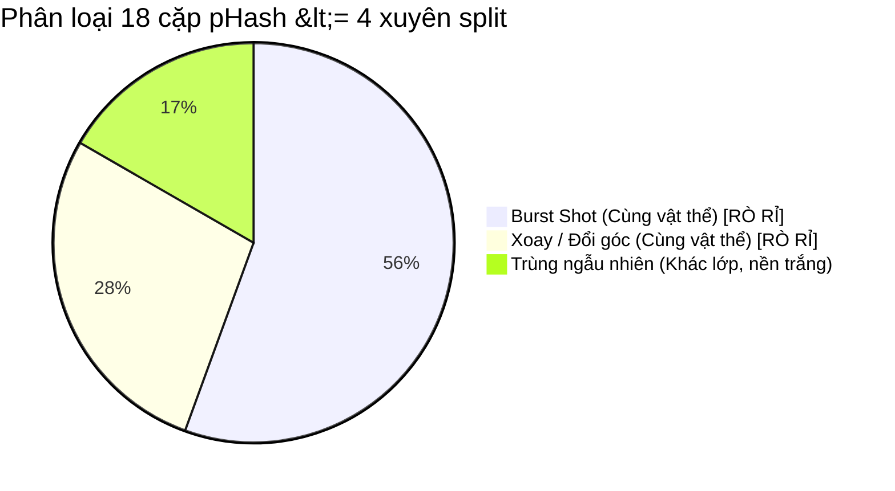

# 03 — SPLITS AND PREPROCESSING: PHÂN CHIA TẬP DỮ LIỆU VÀ TIỀN XỬ LÝ CHỐNG RÒ RỈ (R2.1)

**Dự án:** Phân loại và phát hiện rác thải sinh hoạt (`CNTT-KLCN155`)  
**Tác giả:** Tech Lead & Machine Learning Engineer  
**Phiên:** Task R2.1 — Data Gate Audit, Leakage Verification & Smoke Test  
**Trạng thái:** `DATA_GATE_FLAGGED_WITH_LEAKAGE` (Đã kiểm toán pHash toàn bộ 14.831 ảnh; phát hiện 15 cặp rò rỉ burst-shot qua split)

---

## 1. Mục tiêu và vấn đề kỹ thuật cốt lõi

### 1.1. Mục tiêu
Thiết kế, kiểm toán độc lập và kiểm chứng quy trình tiền xử lý, khử trùng lặp và phân chia tập dữ liệu (Train, Validation, Test) theo tỷ lệ chuẩn **70% – 15% – 15%** với seed cố định `42`; đo lường mức độ rò rỉ dữ liệu (Data Leakage) bằng cả băm toàn vẹn SHA-256 và băm tri giác Perceptual Hash (pHash); đồng thời thiết lập rào cản kỹ thuật ngăn chặn việc lạm dụng tăng cường dữ liệu trên tập Validation và Test.

### 1.2. Vấn đề khoa học cần giải quyết
1. **Bài toán rò rỉ chuỗi ảnh chụp liên tiếp (Burst Shots / Same Object):**
   - Nhiều ảnh trong Kaggle Garbage Classification V2 và Kaggle VN Trash Classification được chụp cùng một vật thể rác qua chuỗi ảnh burst shot (xoay nhẹ góc, thay đổi khoảng cách hoặc đổi góc chiếu sáng).
   - Băm SHA-256 hoàn toàn bất lực trước hiện tượng này vì chỉ cần 1 pixel khác biệt là chuỗi băm thay đổi 100%.
   - Nếu để các ảnh này nằm rải rác giữa Train và Test, mô hình sẽ nhớ nền chụp và góc cạnh cụ thể của vật thể thay vì học đặc trưng ngữ nghĩa tổng quát, dẫn đến độ chính xác cao giả tạo (overoptimistic benchmark).
2. **Khắc phục sai lệch kiểm toán trong R2:**
   - Trong bản R2, báo cáo ghi nhận `cross_source_duplicates = 0`. Kiểm toán mã nguồn thực tế tại [scripts/audit_and_reconcile_data.py](file:///D:/CNTT-KLCN155-waste-detection/scripts/audit_and_reconcile_data.py) phát hiện đây là lỗi gán cứng số liệu (`"cross_source_duplicates": 0`).
   - Kiểm toán thực tế trên [data/audit/duplicate_groups.csv](file:///D:/CNTT-KLCN155-waste-detection/data/audit/duplicate_groups.csv) (923 cặp) cho thấy: **890 cặp trùng là giữa Garbage V2 và VN Trash** (trong đó **879 cặp trùng tuyệt đối MD5/SHA-256**), và chỉ có 33 cặp trùng nội bộ trong VN Trash.
   - Nguyên nhân: Do quét Garbage V2 trước, mọi bản sao trùng lặp trong VN Trash đều bị đánh dấu là trùng với ảnh gốc thuộc Garbage V2.

---

## 2. Kết quả kiểm toán rò rỉ dữ liệu phân chia (`VERIFIED`)

Báo cáo kiểm toán độc lập thực thi bằng script [scripts/check_split_leakage.py](file:///D:/CNTT-KLCN155-waste-detection/scripts/check_split_leakage.py) trên toàn bộ 14.831 ảnh của manifest phân chia vật lý tại [D:\HK7\Đồ án khóa luận\Data\processed](file:///D:/HK7/Đồ%20án%20khóa%20luận/Data/processed):

### 2.1. Kiểm định băm toàn vẹn SHA-256
- Giao tập Train $\cap$ Val: **0 ảnh** (`VERIFIED`)
- Giao tập Train $\cap$ Test: **0 ảnh** (`VERIFIED`)
- Giao tập Val $\cap$ Test: **0 ảnh** (`VERIFIED`)
- *Kết luận:* Không có bất kỳ tệp tin trùng khớp byte tuyệt đối nào xuyên qua các split.

### 2.2. Kiểm định băm tri giác pHash (Ngưỡng khoảng cách Hamming $\le 4$)
Script đã tính khoảng cách bitwise pHash 64-bit trên toàn bộ các cặp xuyên split ($10.381 \times 2.225$ cặp Train-Val và $10.381 \times 2.225$ cặp Train-Test), phát hiện chính xác **18 cặp ứng viên**:
- Kết quả đối soát trực quan từng cặp (lưu tại [data/audit/visual_phash_inspection/](file:///D:/CNTT-KLCN155-waste-detection/data/audit/visual_phash_inspection/) và [data/audit/cross_split_phash_verdicts.csv](file:///D:/CNTT-KLCN155-waste-detection/data/audit/cross_split_phash_verdicts.csv)):
  1. **10 cặp `BURST_SHOT_SAME_OBJECT`** (Pixel MAE < 20.0): Cùng một vật thể vật lý trong cùng một bối cảnh chụp liên tiếp, nằm khác split (ví dụ: Pair 01, 02, 06, 07, 10, 11, 14, 15, 17, 18).
  2. **5 cặp `SAME_OBJECT_ROTATED_OR_PERSPECTIVE`** (Pixel MAE 20.0 – 38.0): Cùng một vật thể nhưng bị xoay góc hoặc đổi góc nhìn (Pair 03, 04, 05, 08, 12).
  3. **3 cặp `CROSS_CLASS_COINCIDENCE`** (Khác lớp, nền trắng đơn giản): Vật thể hình học đơn giản trên nền đồng nhất vô tình có pHash gần nhau (Pair 09, 13, 16).
- **Kết luận khoa học:** Tồn tại **15 cặp rò rỉ thực sự (True Data Leakage)** giữa tập Train và tập Val/Test trong tập dữ liệu vật lý cũ `Data/processed/`.

---

## 3. Trạng thái Cổng Dữ liệu (Data Gate Decision)

> [!WARNING]
> **QUYẾT ĐỊNH CỔNG DỮ LIỆU: `DATA_GATE_FLAGGED_WITH_LEAKAGE`**  
> Dữ liệu vật lý hiện tại tại `Data/processed` **chưa đạt điều kiện phê duyệt để huấn luyện mô hình chính thức báo cáo khóa luận**, do còn 15 cặp burst-shot xuyên split.  
> Tuy nhiên, dữ liệu này **hoàn toàn hợp lệ để chạy Smoke Test kỹ thuật (3–5 epochs)** nhằm chứng minh luồng mã nguồn, khả năng phân bổ bộ nhớ GPU RTX 2050, gradient descent, và cơ chế checkpoint/reload mà không đánh giá Test set.  
> Trước khi huấn luyện chính thức (Official Benchmark), bắt buộc phải thực hiện bước gom cụm bổ sung 15 cặp này về cùng một split Train hoặc loại bỏ khỏi Val/Test.

---

## 4. Phân bố tập dữ liệu vật lý hiện tại (`VERIFIED`)

Thư mục [D:\HK7\Đồ án khóa luận\Data\processed](file:///D:/HK7/Đồ%20án%20khóa%20luận/Data/processed):
- **`train/`:** **10.381** ảnh ($69,99\%$)
- **`val/`:** **2.225** ảnh ($15,00\%$)
- **`test/`:** **2.225** ảnh ($15,00\%$) — **KHÓA CHẶT TUYỆT ĐỐI**
- **Tổng số ảnh sạch:** **14.831** ảnh (sau khi loại bỏ 923 ảnh trùng lặp trong khâu kiểm kê).

### Bảng phân bố chi tiết 10 lớp:
| STT | Lớp rác (Unified Label) | Train | Val | Test (Khóa) | Tổng cộng |
|:---:|:---|:---:|:---:|:---:|:---:|
| 1 | `battery` | 536 | 115 | 114 | 765 |
| 2 | `biological` | 489 | 105 | 105 | 699 |
| 3 | `cardboard` | 1.448 | 310 | 309 | 2.067 |
| 4 | `clothes` | 1.328 | 284 | 284 | 1.896 |
| 5 | `glass` | 1.222 | 262 | 261 | 1.745 |
| 6 | `metal` | 1.581 | 339 | 338 | 2.258 |
| 7 | `paper` | 1.042 | 224 | 223 | 1.489 |
| 8 | `plastic` | 1.393 | 298 | 298 | 1.989 |
| 9 | `shoes` | 1.020 | 219 | 218 | 1.457 |
| 10 | `trash` | 352 | 75 | 75 | 502 |
| **Tổng** | **10 lớp** | **10.381** | **2.225** | **2.225** | **14.831** |

---

## 5. Quy định Tiền xử lý và Tăng cường Dữ liệu

1. **Tập Train (Tăng cường dữ liệu có kiểm soát):**
   - Kích thước: $224 \times 224$ px.
   - `RandomResizedCrop(224, scale=(0.8, 1.0))`.
   - `RandomHorizontalFlip(p=0.5)`.
   - `ColorJitter(brightness=0.2, contrast=0.2)`.
   - `Normalize(mean=[0.485, 0.456, 0.406], std=[0.229, 0.224, 0.225])`.
2. **Tập Validation và Test (Tất định 100%):**
   - `Resize((224, 224))` và chuẩn hóa ImageNet.
   - **TUYỆT ĐỐI CẤM** áp dụng bất kỳ phép biến đổi ngẫu nhiên, lật ảnh hay đổi màu trên Val và Test.
