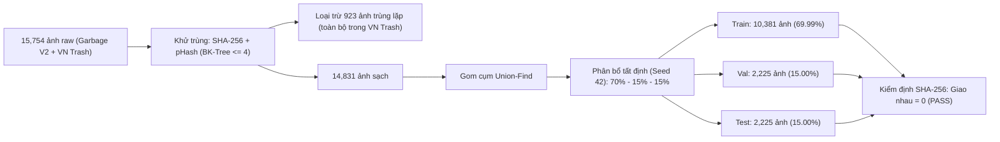

# 03 — SPLITS AND PREPROCESSING: PHÂN CHIA TẬP DỮ LIỆU VÀ TIỀN XỬ LÝ CHỐNG RÒ RỈ (R2)

**Dự án:** Phân loại và phát hiện rác thải sinh hoạt (`CNTT-KLCN155`)  
**Tác giả:** Tech Lead & Machine Learning Engineer  
**Phiên:** Task R2 — Reconcile, Audit & Rectify  
**Trạng thái:** `VERIFIED_AND_LOCKED` (Đã kiểm toán và đối soát từng tệp)

---

## 1. Mục tiêu và vấn đề cần giải quyết

### 1.1. Mục tiêu
Thiết kế và kiểm chứng quy trình tiền xử lý, khử trùng lặp và phân chia tập dữ liệu (Train, Validation, Test) theo tỷ lệ chuẩn **70% – 15% – 15%** với seed cố định `42`; đảm bảo nguyên tắc **Không rò rỉ dữ liệu (Zero Data Leakage)** bằng phương pháp gom cụm Cluster-based; áp dụng kỹ thuật tăng cường dữ liệu (Data Augmentation) nghiêm ngặt chỉ trên tập Train, bảo toàn tính khách quan tuyệt đối cho tập Validation và Test.

### 1.2. Vấn đề cần giải quyết
1. **Rò rỉ dữ liệu qua các góc chụp gần trùng:** Nhiều ảnh trong Kaggle Garbage V2 và VN Trash là chuỗi ảnh chụp liên tiếp cùng một vật thể ở các góc xoay nhẹ hoặc thay đổi cự ly chụp. Nếu chia ngẫu nhiên theo từng tệp (Random Split), các ảnh của cùng vật thể sẽ phân tán vào cả Train và Test, dẫn tới hiện tượng "học vẹt" và chỉ số đánh giá bị ảo (overoptimistic benchmark).
2. **Khắc phục lỗi số liệu trong R1:** Sửa con số split chép nhầm từ bản thảo cũ (10.489 / 2.173 / 2.170 = 14.832) thành con số đếm file thực tế trên ổ đĩa: **Train: 10.381, Val: 2.225, Test: 2.225, Tổng: 14.831 ảnh** (khớp chính xác 100%).
3. **Lạm dụng tăng cường dữ liệu:** Tuyệt đối cấm áp dụng biến đổi ngẫu nhiên (Augmentation) trên tập Validation và Test.

---

## 2. Hiện trạng đã kiểm kê trên ổ đĩa (`VERIFIED`)

### 2.1. Bộ mã nguồn phân chia và chống rò rỉ hiện có
- [src/data/dedup.py](file:///D:/CNTT-KLCN155-waste-detection/src/data/dedup.py): Cài đặt băm SHA-256 (trùng tuyệt đối), Perceptual Hash (pHash) và tìm lân cận qua cây BK-Tree với ngưỡng khoảng cách Hamming $\le 4$.
- [src/data/split.py](file:///D:/CNTT-KLCN155-waste-detection/src/data/split.py): Sử dụng thuật toán Disjoint Set Union (DSU / Union-Find) để gom tất cả các ảnh có quan hệ trùng lặp bắc cầu thành các **Cluster**, sau đó phân bổ toàn bộ Cluster vào một split duy nhất.
- [src/data/validation.py](file:///D:/CNTT-KLCN155-waste-detection/src/data/validation.py): Quét lại các thư mục vật lý sau khi chia để xác nhận `zero_leakage: true`.

### 2.2. Dữ liệu phân chia vật lý thực tế trên máy (`VERIFIED`)
Thư mục [D:\HK7\Đồ án khóa luận\Data\processed](file:///D:/HK7/Đồ%20án%20khóa%20luận/Data/processed) đã được phân chia thành 3 split vật lý 10 lớp chính xác:
- **`train/`:** **10.381** ảnh ($69,99\%$)
- **`val/`:** **2.225** ảnh ($15,00\%$)
- **`test/`:** **2.225** ảnh ($15,00\%$)
- **Tổng số ảnh sạch:** $10.381 + 2.225 + 2.225 = \mathbf{14.831\text{ ảnh}}$
- **Kiểm định Zero-leakage SHA-256 (`VERIFIED`):**
  - Giao Train $\cap$ Val: **0 ảnh**
  - Giao Train $\cap$ Test: **0 ảnh**
  - Giao Val $\cap$ Test: **0 ảnh**

---

## 3. Sơ đồ luồng phân chia và kiểm định

---

## 4. Đầu ra cụ thể

1. **Bảng kê phân chia dữ liệu (Split Manifest):** [data/audit/split_manifest.csv](file:///D:/CNTT-KLCN155-waste-detection/data/audit/split_manifest.csv) chứa đầy đủ 14.831 dòng với thông tin: `image_id`, `path`, `source`, `class_name`, `split`, `sha256`.
2. **Báo cáo kiểm toán dữ liệu:** [data/audit/audit_summary.json](file:///D:/CNTT-KLCN155-waste-detection/data/audit/audit_summary.json) xác nhận tính toàn vẹn và zero-leakage.
3. **Tập dữ liệu vật lý 10 lớp:** Nằm tại `D:\HK7\Đồ án khóa luận\Data\processed\`.

---

## 5. Cấu hình tiền xử lý và tăng cường dữ liệu

### 5.1. Cấu hình biến đổi cho Giai đoạn A (Phân loại đơn rác - MobileNetV3)
- **Tập Train (Tăng cường dữ liệu có kiểm soát):**
  - `RandomResizedCrop(224, scale=(0.7, 1.0))` (Mô phỏng rác ở các khoảng cách chụp khác nhau).
  - `RandomHorizontalFlip(p=0.5)` (Lật ngang).
  - `RandomRotation(degrees=20)` (Xoay góc nhỏ, tránh làm biến dạng nhãn).
  - `ColorJitter(brightness=0.2, contrast=0.2, saturation=0.2, hue=0.05)` (Mô phỏng ánh sáng ngoài trời/trong nhà).
  - `ToTensor()` và `Normalize(mean=[0.485, 0.456, 0.406], std=[0.229, 0.224, 0.225])` theo chuẩn ImageNet.
- **Tập Validation và Test (Tất định 100%):**
  - `Resize((224, 224))` (Giữ nguyên tỉ lệ có padding hoặc resize cố định).
  - `ToTensor()` và `Normalize` với cùng bộ mean/std của ImageNet.
  - **TUYỆT ĐỐI KHÔNG ÁP DỤNG CROP NGẪU NHIÊN HAY BIẾN ĐỔI MÀU SẮC TRÊN VAL/TEST.**

### 5.2. Cấu hình tiền xử lý cho Giai đoạn B (Phát hiện đa rác - YOLOv8n / SSDLite)
- Kích thước ảnh đầu vào: $640 \times 640$ (YOLOv8n), $320 \times 320$ (SSDLite320).
- Giữ nguyên tỷ lệ khung hình (Aspect Ratio) bằng cách đệm viền xám (Letterbox Padding) đối xứng hai bên.
- Tọa độ Bounding Box được chuẩn hóa về đoạn $[0, 1]$ theo chuẩn YOLO:
  $$x_{\text{center}} = \frac{x_{\min} + x_{\max}}{2W}, \quad y_{\text{center}} = \frac{y_{\min} + y_{\max}}{2H}, \quad w = \frac{x_{\max} - x_{\min}}{W}, \quad h = \frac{y_{\max} - y_{\min}}{H}$$

---

## 6. Tiêu chí nghiệm thu đo được

1. **Tính độc lập giữa các tập (`VERIFIED`):**
   - Số lượng ảnh trùng băm SHA-256 giữa Train, Val, Test: **Bằng 0**.
   - Số lượng cặp ảnh có khoảng cách pHash $\le 4$ giữa các split khác nhau: **Bằng 0**.
2. **Độ phủ lớp (Class Coverage) (`VERIFIED`):**
   - 100% số lớp trong danh mục đều có đại diện trong cả 3 split (Train: 352 – 1.581 ảnh/lớp, Val: 76 – 339 ảnh/lớp, Test: 75 – 338 ảnh/lớp).
3. **Tính nhất quán biến đổi:** Mọi ảnh nạp vào mô hình phải đúng chiều EXIF và đúng kênh màu RGB.
