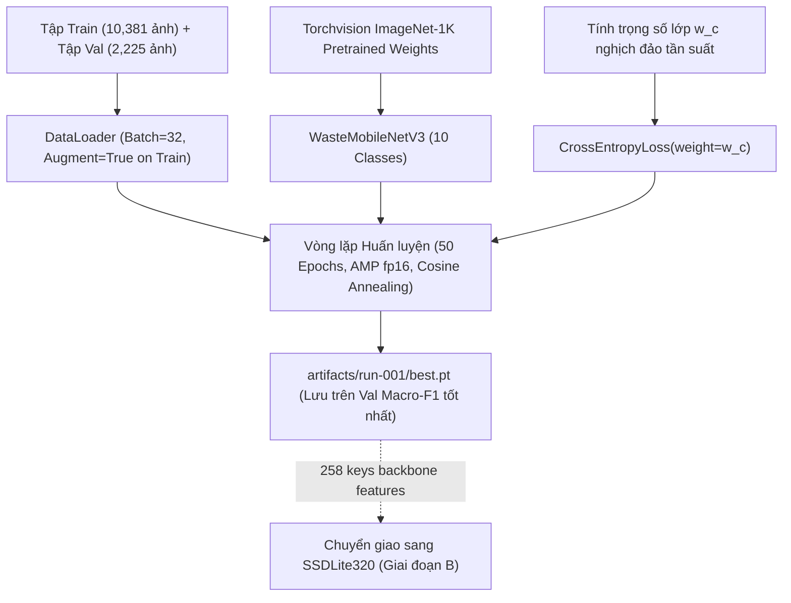

# 05 — SINGLE OBJECT TRAINING: HUẤN LUYỆN MÔ HÌNH PHÂN LOẠI ĐƠN RÁC (GIAI ĐOẠN A) (R2)

**Dự án:** Phân loại và phát hiện rác thải sinh hoạt (`CNTT-KLCN155`)  
**Tác giả:** Tech Lead & Machine Learning Engineer  
**Phiên:** Task R2 — Reconcile, Audit & Rectify  
**Trạng thái:** `VERIFIED_AND_LOCKED` (Đã đồng bộ dữ liệu và trọng số chuẩn)

---

## 1. Mục tiêu và vấn đề cần giải quyết

### 1.1. Mục tiêu
Huấn luyện và tinh chỉnh (fine-tune) một mô hình học sâu nhẹ chuyên biệt cho nhiệm vụ **phân loại đơn rác 10 lớp** trên tập dữ liệu 10.381 ảnh train sạch của dự án; đạt độ chính xác cao (Top-1 Accuracy $\ge 88.0\%$, Macro-F1 $\ge 0.850$), suy luận cực nhanh trên cả CPU và GPU máy tính cá nhân; đồng thời đóng vai trò trích xuất đặc trưng nền tảng (Feature Extractor) để chuyển giao 258 tensor keys backbone sang mô hình phát hiện đa rác SSDLite320 ở Giai đoạn B.

### 1.2. Vấn đề cần giải quyết
1. **Khắc phục nguy cơ nhiễm tập test từ checkpoint pre-trained:** Checkpoint Ecovision có trạng thái `PRETRAINING_OVERLAP_UNKNOWN` trên Garbage V2. Do đó, luồng huấn luyện chính thức sẽ khởi tạo từ **ImageNet-1K chuẩn** (`torchvision.models.mobilenet_v3_large(weights='DEFAULT')`), đảm bảo kết quả đánh giá trên tập test là hoàn toàn khách quan. Ecovision được giữ lại làm baseline đối chứng ngoại bộ.
2. **Cập nhật số lượng ảnh thực tế chính xác:** Train = **10.381** ảnh, Val = **2.225** ảnh, Test = **2.225** ảnh (tổng 14.831 ảnh sạch).
3. **Xử lý mất cân bằng lớp:** Áp dụng Class-Weighted CrossEntropyLoss bù trọng số cho lớp `trash` (352 ảnh train) và `biological` (489 ảnh train) so với `metal` (1.581 ảnh train) và `cardboard` (1.448 ảnh train).

---

## 2. Hiện trạng đã kiểm kê trên ổ đĩa (`VERIFIED`)

1. **Bộ mã nguồn huấn luyện phân loại hiện có:**
   - [src/models/mobilenet.py](file:///D:/CNTT-KLCN155-waste-detection/src/models/mobilenet.py): Định nghĩa lớp `WasteMobileNetV3` kế thừa từ `torchvision.models.mobilenet_v3_large`.
   - [src/training/engine.py](file:///D:/CNTT-KLCN155-waste-detection/src/training/engine.py): Cài đặt vòng lặp huấn luyện chuẩn PyTorch với AMP fp16, gradient clipping và tính toán loss/accuracy qua từng epoch.
   - [src/training/checkpoint.py](file:///D:/CNTT-KLCN155-waste-detection/src/training/checkpoint.py): Quản lý lưu trữ trạng thái `checkpoint_last.pt` và `best.pt`.
2. **Dữ liệu huấn luyện 10 lớp:**
   - [D:\HK7\Đồ án khóa luận\Data\processed](file:///D:/HK7/Đồ%20án%20khóa%20luận/Data/processed): Train **10.381** ảnh, Val **2.225** ảnh, Test **2.225** ảnh.
3. **Trọng số khởi tạo:**
   - Trọng số chính thức: ImageNet-1K (`torchvision.models.MobileNet_V3_Large_Weights.DEFAULT`).
   - Trọng số tham chiếu: [artifacts/ecovision/best.pt](file:///D:/CNTT-KLCN155-waste-detection/artifacts/ecovision/best.pt) (đối chứng baseline).

---

## 3. Sơ đồ luồng huấn luyện Giai đoạn A

---

## 4. Cấu hình siêu tham số và giải pháp kỹ thuật

| Tham số | Giá trị | Cơ sở kỹ thuật |
|:---|:---:|:---|
| **Mô hình** | MobileNetV3-Large | Siêu nhẹ (5.4M params), suy luận ~12ms trên CPU |
| **Trọng số bắt đầu** | ImageNet-1K (`DEFAULT`) | Tránh nguy cơ Data Contamination từ các checkpoint bên thứ ba |
| **Kích thước ảnh** | $224 \times 224$ px | Chuẩn thiết kế Torchvision MobileNetV3 |
| **Batch Size** | 32 | Chiếm ~2.1 GB VRAM trên RTX 2050 (an toàn trong mức 4 GB) |
| **Workers** | 4 | Tối ưu thông lượng đọc dữ liệu CPU 6 cores 12 threads |
| **Max Epochs / Patience** | 50 / 10 | Early stopping dựa trên Validation Macro-F1 |
| **Loss Function** | Weighted Cross-Entropy | Khắc phục chênh lệch giữa lớp 352 mẫu và 1.581 mẫu |
| **Optimizer** | AdamW ($lr=5 \times 10^{-4}$, weight decay=$1 \times 10^{-2}$) | Gradient ổn định, chống overfitting |

---

## 5. Tiêu chí nghiệm thu đo được

1. **Chỉ số trên tập Validation (2.225 ảnh):**
   - Top-1 Accuracy: $\ge 88.0\%$
   - Macro-F1 Score: $\ge 0.850$
2. **Khả năng phục hồi (Resume Capability):**
   - Hỗ trợ resume từ `checkpoint_last.pt` khi bị ngắt ngang.
3. **Tiêu thụ tài nguyên:**
   - Bộ nhớ VRAM GPU $\le 3.0\text{ GB}$ trên card NVIDIA RTX 2050.
