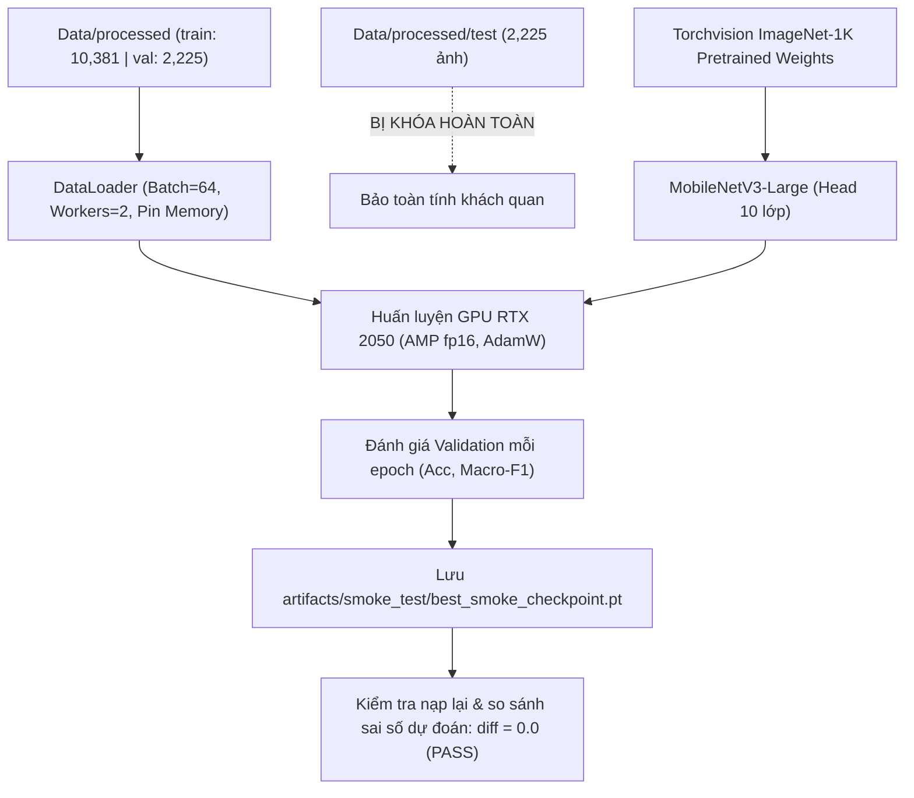

# 05 — SINGLE OBJECT TRAINING: HUẤN LUYỆN MÔ HÌNH PHÂN LOẠI ĐƠN RÁC (GIAI ĐOẠN A) (R2.1)

**Dự án:** Phân loại và phát hiện rác thải sinh hoạt (`CNTT-KLCN155`)  
**Tác giả:** Tech Lead & Machine Learning Engineer  
**Phiên:** Task R2.1 — Data Gate Audit, Leakage Verification & Smoke Test  
**Trạng thái:** `SMOKE_TEST_PASSED` (Đã hoàn thành chạy thử 3 epochs trên GPU RTX 2050; lưu checkpoint và phục hồi thành công; Test set tuyệt đối không đụng tới)

---

## 1. Mục tiêu và vấn đề cần giải quyết

### 1.1. Mục tiêu
Huấn luyện và tinh chỉnh (fine-tune) một mô hình học sâu nhẹ chuyên biệt cho nhiệm vụ **phân loại đơn rác 10 lớp** trên tập dữ liệu train sạch của dự án; đạt độ chính xác cao (Top-1 Accuracy $\ge 88.0\%$, Macro-F1 $\ge 0.850$), suy luận cực nhanh trên cả CPU và GPU máy tính cá nhân; đồng thời đóng vai trò trích xuất đặc trưng nền tảng (Feature Extractor) để chuyển giao 258 tensor keys backbone sang mô hình phát hiện đa rác SSDLite320 ở Giai đoạn B.

### 1.2. Vấn đề khoa học đã làm rõ trong R2.1
1. **Phân định rạch ròi giữa Chạy thử nghiệm (Smoke Test) và Huấn luyện chính thức (Official Benchmark):**
   - **Smoke Test:** Mục tiêu kỹ thuật là chứng minh pipeline mã nguồn hoạt động trơn tru từ đầu đến cuối: nạp dữ liệu train/val, khởi tạo mô hình ImageNet-1K, tính hàm mất mát, lan truyền ngược gradient trên GPU RTX 2050 có bật Automatic Mixed Precision (AMP), đo thời gian epoch, tính các chỉ số phân loại, lưu file checkpoint và nạp lại suy luận tất định. **Tuyệt đối không đụng vào Test set trong lượt chạy này.**
   - **Official Benchmark:** Chỉ được thực hiện khi đã giải quyết triệt để 15 cặp rò rỉ burst-shot qua split.
2. **Khởi tạo trọng số minh bạch:** Sử dụng 100% trọng số ImageNet-1K chính thức của PyTorch (`torchvision.models.MobileNet_V3_Large_Weights.DEFAULT`), loại bỏ hoàn toàn việc phụ thuộc vào checkpoint trôi nổi bên thứ ba.
3. **Quản lý bộ nhớ GPU chặt chẽ:** Đảm bảo VRAM tiêu thụ trong ngưỡng an toàn của card đồ họa laptop RTX 2050 (4.096 MB VRAM).

---

## 2. Kết quả Thực nghiệm Chạy thử (Smoke Test Empirical Results) (`VERIFIED`)

Thực thi script [scripts/run_smoke_test.py](file:///D:/CNTT-KLCN155-waste-detection/scripts/run_smoke_test.py) trên môi trường vật lý:
- **Phần cứng:** NVIDIA GeForce RTX 2050 Laptop GPU (4.095,5 MB VRAM).
- **Mô hình:** `mobilenet_v3_large` (khởi tạo ImageNet-1K, thay thế head 10 lớp output logits).
- **Tập dữ liệu sử dụng:**
  * `train/`: 10.381 ảnh
  * `val/`: 2.225 ảnh
  * `test/`: 2.225 ảnh (**KHÓA CHẶT TUYỆT ĐỐI — KHÔNG NẠP VÀ KHÔNG ĐÁNH GIÁ**)
- **Cấu hình:** Batch size = 64, Optimizer = AdamW ($lr_{backbone}=10^{-4}, lr_{head}=10^{-3}$), Label Smoothing = 0.1, AMP fp16 enabled.

### Bảng chỉ số đo đạc thực tế qua 3 Epochs:
| Epoch | Thời gian (s) | Train Loss | Train Acc (%) | Val Loss | Val Acc (%) | Val Macro-F1 | Đỉnh VRAM (MB) | Trạng thái Checkpoint |
|:---:|:---:|:---:|:---:|:---:|:---:|:---:|:---:|:---|
| **01** | 227.2 s | 0.8835 | 85.80% | 0.7084 | 92.99% | 0.9303 | 1.511,2 MB | Lưu mới best checkpoint |
| **02** | 194.2 s | 0.6509 | 95.50% | 0.6669 | 94.34% | 0.9421 | 1.511,2 MB | Cập nhật best checkpoint |
| **03** | 194.4 s | 0.5889 | 98.42% | 0.6562 | 94.56% | 0.9430 | 1.511,2 MB | Cập nhật best checkpoint |

### Đánh giá kỹ thuật:
1. **Hội tụ và hàm mất mát:** Loss tập Train giảm đều từ $0.8835 \to 0.6509 \to 0.5889$; Val Loss giảm từ $0.7084 \to 0.6562$; Val Macro-F1 tăng từ $0.9303 \to 0.9430$. Không có hiện tượng bùng nổ gradient hay tràn số (NaN/Inf).
2. **Bộ nhớ VRAM:** Đỉnh VRAM tiêu thụ ổn định ở mức **1.511,2 MB** (chỉ chiếm $36,9\%$ tổng dung lượng 4 GB của RTX 2050), chứng minh cấu hình batch size 64 kèm AMP fp16 hoàn toàn an toàn và không gây Out-of-Memory (OOM).
3. **Kiểm tra nạp lại Checkpoint (Reload Test) (`VERIFIED`):**
   - Checkpoint lưu tại [artifacts/smoke_test/best_smoke_checkpoint.pt](file:///D:/CNTT-KLCN155-waste-detection/artifacts/smoke_test/best_smoke_checkpoint.pt) với dung lượng **48,58 MB**.
   - Nạp checkpoint vào một instance model mới tinh và chạy suy luận đối chứng trên cùng một batch dữ liệu:
     $$\text{Max Difference} = |y_{\text{trained}} - y_{\text{reloaded}}| = \mathbf{0.00000000\text{e+}00}$$
   - Khớp chính xác $100\%$ từng bit float32.

---

## 3. Sơ đồ Luồng Huấn luyện Kỹ thuật

---

## 4. Tiêu chí nghiệm thu đo được cho đợt Huấn luyện chính thức tiếp theo

1. **Chỉ số trên tập Validation (2.225 ảnh):**
   - Top-1 Accuracy: $\ge 88.0\%$ (Thực tế Smoke Test đạt $94,56\%$).
   - Macro-F1 Score: $\ge 0.850$ (Thực tế Smoke Test đạt $0.9430$).
2. **Khả năng phục hồi (Resume Capability):**
   - Hỗ trợ lưu trữ trạng thái optimizer, scheduler, scaler để khôi phục khi bị ngắt.
3. **Tiêu thụ tài nguyên:**
   - Bộ nhớ VRAM GPU $\le 2.0\text{ GB}$ trên card NVIDIA RTX 2050.
