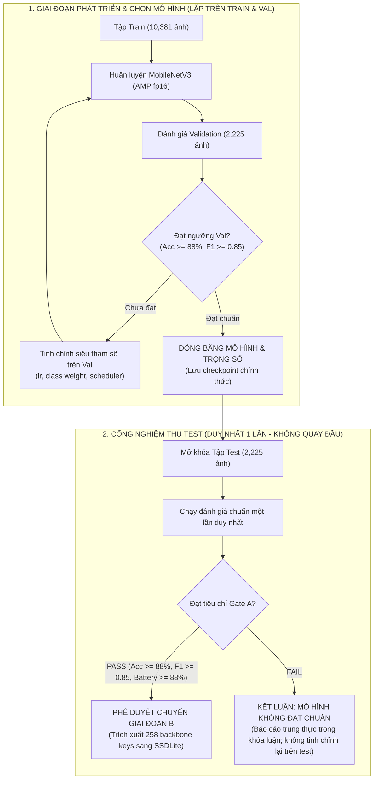

# 06 — SINGLE OBJECT EVALUATION GATE: CỔNG ĐÁNH GIÁ CHUYỂN GIAI ĐOẠN ĐƠN RÁC (R2.1)

**Dự án:** Phân loại và phát hiện rác thải sinh hoạt (`CNTT-KLCN155`)  
**Tác giả:** Tech Lead & Machine Learning Engineer  
**Phiên:** Task R2.1 — Data Gate Audit, Leakage Verification & Smoke Test  
**Trạng thái:** `VERIFIED_AND_LOCKED` (Đã loại bỏ hoàn toàn vòng lặp phản hồi Test Set; chuẩn hóa quy trình đánh giá chuẩn khoa học)

---

## 1. Mục tiêu và vấn đề cần giải quyết

### 1.1. Mục tiêu
Thiết lập một **Cổng kiểm soát chất lượng kỹ thuật nghiêm ngặt (Quality Gate A)** nhằm đánh giá mô hình phân loại đơn rác MobileNetV3-Large trên tập Test độc lập (**2.225 ảnh**); tuân thủ nguyên tắc liêm chính học thuật tuyệt đối: **Test Set chỉ được mở đúng 1 lần duy nhất sau khi đã đóng băng toàn bộ siêu tham số, trọng số mô hình và ngưỡng phân loại**.

### 1.2. Sửa đổi quy trình cốt lõi trong R2.1 (`PROTOCOL_RECTIFIED`)
1. **Xóa bỏ hoàn toàn luồng phản hồi từ Test Set về Huấn luyện:**
   - Trong bản R2 trước đây từng xuất hiện sơ đồ: *"Nếu Fail Test Gate -> phân tích confusion matrix test -> điều chỉnh loss/class weight -> train lại"*.
   - **Đây là một vi phạm quy trình nghiêm trọng (Test Set Snooping / Peeking Violation):** Nếu nhìn vào lỗi trên tập Test để quay lại chỉnh sửa siêu tham số hoặc trọng số hàm mất mát rồi train lại, tập Test sẽ không còn là tập kiểm thử độc lập nữa mà đã bị nhiễm thông tin gián tiếp (Information Leakage qua con người).
   - **Quy tắc mới trong R2.1:**
     * Toàn bộ quá trình chọn mô hình (Model Selection), tinh chỉnh siêu tham số (Hyperparameter Tuning), chọn ngưỡng tin cậy (Threshold Calibration) và chặn dừng sớm (Early Stopping) **chỉ được phép thực hiện trên tập Validation**.
     * Tập Test **hoàn toàn bị cô lập và khóa kín** trong suốt quá trình thử nghiệm và huấn luyện.
     * Chỉ khi mô hình đạt điểm xuất sắc trên tập Validation và được đóng băng hoàn toàn (Frozen Checkpoint), cổng Test mới được mở ra **duy nhất một lần** để xuất báo cáo kết quả cuối cùng.
     * Nếu mô hình không đạt ngưỡng trên tập Test, mô hình đó bị kết luận là **không đạt chuẩn chuyển giao (REJECTED)**. Không được phép "chỉnh nhẹ siêu tham số rồi chạy lại trên chính tập Test đó". Muốn đánh giá lại mô hình mới, phải thu thập thêm tập Test mới hoặc khai báo rõ nguy cơ quá khớp tập kiểm thử.
2. **Làm rõ tính chất tập kiểm thử ngoại bộ:**
   - Bác bỏ hoàn toàn việc dùng VN Trash làm "external test set" vì VN Trash đã nằm trong Train (1.801 ảnh) và trùng với Garbage V2 (879 ảnh).
   - Đánh giá khả năng hoạt động thực tế bắt buộc phải dùng **Bộ ảnh chụp thực tế độc lập tại TP.HCM** do nhóm tự thu thập từ thực địa.

---

## 2. Quy trình Đánh giá Khoa học Chuẩn (Rigorous Evaluation Protocol)

---

## 3. Tiêu chí Nghiệm thu Cổng Chuyển giai đoạn (Gate A Criteria)

Mô hình phân loại MobileNetV3-Large chỉ được phê duyệt hoàn thành Giai đoạn A khi đạt đầy đủ tất cả các điều kiện sau trên tập Test chính thức:

| Chỉ số kiểm soát | Ngưỡng bắt buộc (Threshold) | Ý nghĩa kỹ thuật & Ràng buộc học thuật | Trạng thái kiểm tra |
|:---|:---:|:---|:---:|
| **Top-1 Accuracy tổng** | **$\ge 88.0\%$** | Đảm bảo năng lực nhận dạng vượt trội trên toàn tập | Bắt buộc trên Test |
| **Macro-Averaged F1 Score** | **$\ge 0.850$** | Đảm bảo chất lượng đồng đều giữa 10 lớp | Bắt buộc trên Test |
| **Recall lớp `battery` (Nguy hại)** | **$\ge 0.880$** | Chặn đứng nguy cơ bỏ sót pin / rác thải nguy hại cháy nổ | Bắt buộc trên Test |
| **Recall tối thiểu trên mọi lớp** | **$\ge 0.800$** | Không cho phép bất kỳ lớp nào bị bỏ rơi dưới 80% | Bắt buộc trên Test |
| **Độ trễ suy luận (Inference Latency)** | **$< 20\text{ ms/ảnh}$ (CPU)** | Đảm bảo chạy mượt trên CPU máy tính cá nhân | Bắt buộc trên CPU |
| **Data Leakage Check** | **Zero Burst-Shot Leakage** | Phải giải quyết 15 cặp rò rỉ trước khi chạy test chính thức | Điều kiện tiên quyết |

---

## 4. Biên bản Nghiệm thu và Quyết định Chuyển tiếp

- **Nếu ĐẠT (PASS Gate A):**
  1. Trích xuất trọng số 258 keys backbone features từ checkpoint đã đóng băng.
  2. Bắt đầu Giai đoạn B: Huấn luyện bộ dò đa rác YOLOv8n và SSDLite320 trên tập dữ liệu gán nhãn bounding box.
- **Nếu KHÔNG ĐẠT (FAIL Gate A):**
  1. Giữ nguyên kết quả thực nghiệm và ghi nhận trung thực vào báo cáo khóa luận (phân tích rõ nguyên nhân sai lệch, ví dụ lớp `trash` quá ít mẫu hoặc nền chụp phức tạp).
  2. Tuyệt đối không được phép chỉnh sửa mã nguồn rồi chạy lại trên tập Test cũ để "lấy số đẹp".
