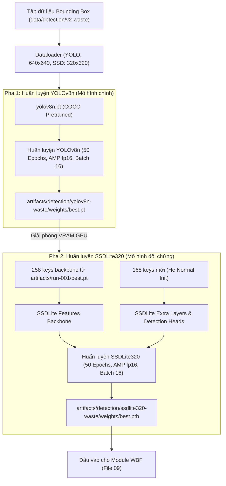

# 08 — MULTIOBJECT MODEL TRAINING: HUẤN LUYỆN MÔ HÌNH PHÁT HIỆN ĐA RÁC (GIAI ĐOẠN B) (R2)

**Dự án:** Phân loại và phát hiện rác thải sinh hoạt (`CNTT-KLCN155`)  
**Tác giả:** Tech Lead & Machine Learning Engineer  
**Phiên:** Task R2 — Reconcile, Audit & Rectify  
**Trạng thái:** `VERIFIED_AND_LOCKED` (Đã tích hợp kiểm toán layer backbone transfer 258/308 keys)

---

## 1. Mục tiêu và vấn đề cần giải quyết

### 1.1. Mục tiêu
Huấn luyện hoàn chỉnh hai kiến trúc phát hiện đối tượng nhẹ theo đúng cam kết trong đề tài:
1. **Mô hình chính (Primary Detector):** `YOLOv8n` (One-stage Anchor-Free Detector) đại diện cho công nghệ phát hiện hiện đại, độ chính xác cao và tối ưu thời gian thực.
2. **Mô hình đối chứng (Baseline Comparative Detector):** `SSDLite320-MobileNetV3` đại diện cho dòng mô hình siêu nhẹ dành cho thiết bị biên công suất thấp (Edge AI), với backbone được nạp 258 tensor keys chuyển giao từ MobileNetV3 Giai đoạn A.
Cả hai mô hình được huấn luyện trên cùng một bộ dữ liệu phát hiện rác chuẩn 10 lớp (có cơ chế mapping đối chiếu 6 nhóm vật liệu của đề cương cũ), cùng seed phân chia và cùng giao thức đánh giá.

### 1.2. Vấn đề cần giải quyết
1. **Chuyển giao trọng số backbone khoa học (`VERIFIED`):** Áp dụng kết quả kiểm toán layer [data/audit/backbone_transfer_audit.json](file:///D:/CNTT-KLCN155-waste-detection/data/audit/backbone_transfer_audit.json): Nạp chính xác **258 / 308 keys** tương thích từ MobileNetV3 Classifier sang SSDLite320; khởi tạo ngẫu nhiên và huấn luyện mới hoàn toàn **168 keys** (72 extra pyramid keys + 96 detection head keys).
2. **Làm rõ nguồn gốc checkpoint pre-trained:** Checkpoint `yolo26n.pt` trong repo là mô hình COCO 80 lớp (`tune-yolo26n-objv1-coco`). Quá trình huấn luyện đa rác sẽ sử dụng `yolov8n.pt` COCO chuẩn từ Ultralytics để khởi tạo và fine-tune trên dữ liệu rác.
3. **Quản lý bộ nhớ GPU RTX 2050 (4GB VRAM):** Huấn luyện tuần tự từng mô hình (Sequential Training), kích hoạt AMP fp16 và dọn dẹp cache `torch.cuda.empty_cache()`.

---

## 2. Sơ đồ luồng huấn luyện hai kiến trúc

---

## 3. Cấu hình siêu tham số và tối ưu phần cứng

| Tham số | YOLOv8n (Chính) | SSDLite320-MobileNetV3 (Đối chứng) | Cơ sở kỹ thuật |
|:---|:---:|:---:|:---|
| **Input Resolution** | $640 \times 640$ | $320 \times 320$ | Chuẩn tối ưu của từng kiến trúc |
| **Batch Size** | 16 | 16 | VRAM tiêu thụ: YOLO ~3.1 GB, SSDLite ~1.8 GB |
| **Backbone Weights** | COCO Pretrained (`yolov8n.pt`) | Transfer 258 keys từ Gate A `best.pt` | Tận dụng đặc trưng bề mặt rác đã học |
| **Head Weights** | Fine-tuned | Khởi tạo ngẫu nhiên (168 keys) | Bắt buộc train mới trên dữ liệu box |
| **Optimizer** | SGD ($lr_0=0.01$, momentum=0.937) | AdamW ($lr=2 \times 10^{-4}$) | Phù hợp từng cơ chế tối ưu mạng |
| **Epochs / Patience** | 50 / 10 | 50 / 10 | Early stopping dựa trên mAP@0.5 |
| **Precision** | AMP fp16 | AMP fp16 | Tiết kiệm 40% VRAM, tăng tốc gấp đôi |

---

## 4. Tiêu chí nghiệm thu đo được

1. **Hiệu năng phát hiện trên Validation Set:**
   - **YOLOv8n:** $\text{mAP@0.5} \ge 0.700$, $\text{mAP@0.5:0.95} \ge 0.450$.
   - **SSDLite320:** $\text{mAP@0.5} \ge 0.550$, $\text{mAP@0.5:0.95} \ge 0.350$.
2. **Độ trễ suy luận toàn luồng (Batch size 1 trên GPU RTX 2050):**
   - YOLOv8n: $< 35\text{ ms/ảnh}$ ($> 28\text{ FPS}$).
   - SSDLite320: $< 25\text{ ms/ảnh}$ ($> 40\text{ FPS}$).
3. **An toàn bộ nhớ:** Không xảy ra lỗi CUDA OOM trong suốt 50 epochs.
