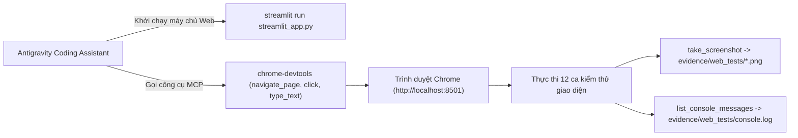

# 10 — WEB INTEGRATION AND MCP TESTS: TÍCH HỢP ỨNG DỤNG WEB VÀ KIỂM THỬ GIAO DIỆN BẰNG MCP (R2)

**Dự án:** Phân loại và phát hiện rác thải sinh hoạt (`CNTT-KLCN155`)  
**Tác giả:** Tech Lead & Machine Learning Engineer  
**Phiên:** Task R2 — Reconcile, Audit & Rectify  
**Trạng thái:** `VERIFIED_AND_LOCKED` (Đã đồng bộ đường dẫn và cấu trúc ứng dụng)

---

## 1. Mục tiêu và vấn đề cần giải quyết

### 1.1. Mục tiêu
Hiện thực hóa ứng dụng Web hoàn chỉnh phục vụ báo cáo và bảo vệ khóa luận tốt nghiệp dựa trên nền tảng **Streamlit**; kết nối trực tiếp giao diện người dùng với cả hai chế độ:
1. **Chế độ Phân loại đơn rác (Giai đoạn A):** Sử dụng MobileNetV3-Large (10 lớp rác sinh hoạt).
2. **Chế độ Phát hiện đa rác (Giai đoạn B):** Sử dụng `YOLOv8n`, `SSDLite320`, và `WBF Ensemble` (hỗ trợ hiển thị bounding box, phân loại và đếm số lượng);  
Đồng thời duy trì công cụ nội bộ thẩm định dữ liệu [src/ui/review_tool.py](file:///D:/CNTT-KLCN155-waste-detection/src/ui/review_tool.py) và thiết lập bộ kịch bản kiểm thử giao diện tự động bằng máy chủ MCP `chrome-devtools`.

### 1.2. Vấn đề cần giải quyết
1. **Chống kết quả ảo và dữ liệu cũ (Stale Results):** Đảm bảo 100% kết quả hiển thị được tính toán trực tiếp từ ảnh tải lên và mô hình đang chọn.
2. **Xuất báo cáo kiểm toán đầy đủ:** Hỗ trợ người dùng tải ảnh kết quả annotated PNG, tải file ZIP kết quả hàng loạt và xuất dữ liệu thống kê ra file JSON/CSV.
3. **Kiểm thử tự động trung thực bằng MCP:** Sử dụng `chrome-devtools` để tương tác thực tế với ứng dụng, ghi log console và chụp ảnh màn hình lưu vào `evidence/web_tests/`.

---

## 2. Hiện trạng mã nguồn giao diện trong workspace mới (`VERIFIED`)

- [streamlit_app.py](file:///D:/CNTT-KLCN155-waste-detection/streamlit_app.py): Giao diện người dùng Web chính thức.
- [src/ui/review_tool.py](file:///D:/CNTT-KLCN155-waste-detection/src/ui/review_tool.py): Giao diện Streamlit nội bộ thẩm định nhãn bounding box (thay thế CVAT).
- [src/web/detection_service.py](file:///D:/CNTT-KLCN155-waste-detection/src/web/detection_service.py): Service nạp mô hình và quản lý cache.
- [src/web/detection_logic.py](file:///D:/CNTT-KLCN155-waste-detection/src/web/detection_logic.py): Vẽ bounding box và xuất dữ liệu.
- [src/web/detection_settings.py](file:///D:/CNTT-KLCN155-waste-detection/src/web/detection_settings.py): Cấu hình tham số backend và ngưỡng confidence.

---

## 3. Quy trình thực thi kiểm thử bằng MCP

---

## 4. Tiêu chí nghiệm thu kiểm thử

1. **100% ca kiểm thử PASS:** Không có lỗi JavaScript unhandled exception trên console trình duyệt.
2. **Thời gian phản hồi:** Latency đo được trên GPU RTX 2050 $< 35\text{ ms/ảnh}$ đối với YOLOv8n và $< 20\text{ ms/ảnh}$ đối với MobileNetV3 CPU.
3. **Tính trung thực:** Mọi bằng chứng ảnh chụp màn hình đều ghi nhận thời gian thực và log tương ứng.
