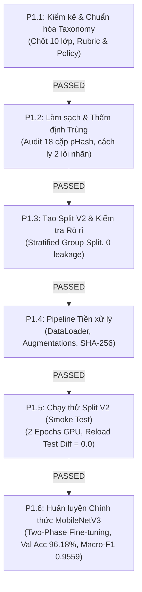

# KẾ HOẠCH VÀ TRẠNG THÁI CÁC NHIỆM VỤ CON VÀ CỔNG NGHIỆM THU — PHẦN 1

**Dự án:** Hệ thống Phân loại và Phát hiện Rác thải Sinh hoạt (`CNTT-KLCN155`)  
**Học phần:** PHẦN 1 — Tiền xử lý dữ liệu và huấn luyện MobileNetV3 phân loại rác  
**Chủ dự án (PM):** ThS. Ngô Thanh Nhân  
**Tech Lead ML:** Antigravity Engineering Team  
**Thời điểm cập nhật:** 01/10/2026  
**Trạng thái tổng thể:** `COMPLETED` (Toàn bộ 6 subtasks P1.1 - P1.6 đã hoàn thành và đạt chuẩn nghiệm thu)

---

## 1. Sơ đồ Quan hệ Phụ thuộc và Trạng thái 6 Subtasks

---

## 2. Bảng Theo dõi Tiến độ và Nghiệm thu Từng Task Con

| Mã Task | Tên Nhiệm vụ Con | Điều kiện Tiên quyết | Đầu ra & Bằng chứng Kỹ thuật | Trạng thái |
|:---|:---|:---|:---|:---:|
| **P1.1** | Kiểm kê và chuẩn hóa taxonomy | Dữ liệu raw tại `Data/raw` | - [data/metadata/label_mapping.csv](file:///D:/CNTT-KLCN155-waste-detection/data/metadata/label_mapping.csv) - Tài liệu định nghĩa chính sách phân loại vật liệu đồng nhất và trường hợp phức hợp. | **DONE** |
| **P1.2** | Làm sạch và thẩm định ảnh trùng | P1.1 hoàn thành | - [scripts/inspect_plate_details.py](file:///D:/CNTT-KLCN155-waste-detection/scripts/inspect_plate_details.py) - Bảng thẩm định trực quan toàn bộ 18 cặp ứng viên pHash - Báo cáo chuỗi liên kết [data/audit/transitive_chains_report.json](file:///D:/CNTT-KLCN155-waste-detection/data/audit/transitive_chains_report.json) - Cách ly 2 mẫu xung đột nhãn tại [data/audit/quarantined_samples.csv](file:///D:/CNTT-KLCN155-waste-detection/data/audit/quarantined_samples.csv). | **DONE** |
| **P1.3** | Tạo split mới và kiểm tra rò rỉ | P1.2 hoàn thành | - [scripts/create_split_v2.py](file:///D:/CNTT-KLCN155-waste-detection/scripts/create_split_v2.py) - Manifest mới [data/audit/split_manifest_v2.csv](file:///D:/CNTT-KLCN155-waste-detection/data/audit/split_manifest_v2.csv) (14.829 ảnh) - Báo cáo [data/audit/split_v2_summary.json](file:///D:/CNTT-KLCN155-waste-detection/data/audit/split_v2_summary.json) - Báo cáo kiểm toán [data/audit/leakage_audit_report.json](file:///D:/CNTT-KLCN155-waste-detection/data/audit/leakage_audit_report.json) xác nhận `ZERO_LEAKAGE_VERIFIED`. | **DONE** |
| **P1.4** | Pipeline tiền xử lý & DataLoader | P1.3 hoàn thành | - [scripts/verify_preprocessing_pipeline.py](file:///D:/CNTT-KLCN155-waste-detection/scripts/verify_preprocessing_pipeline.py) - Thư mục vật lý `data/processed_v2/` khớp 100% manifest - Báo cáo kiểm định [data/audit/preprocessing_pipeline_verification.json](file:///D:/CNTT-KLCN155-waste-detection/data/audit/preprocessing_pipeline_verification.json). | **DONE** |
| **P1.5** | Chạy thử trên split mới (Smoke Test) | P1.4 hoàn thành | - [scripts/run_smoke_test_v2.py](file:///D:/CNTT-KLCN155-waste-detection/scripts/run_smoke_test_v2.py) - 2 epochs trên GPU RTX 2050 (Train Loss 0.6538, Val Acc 95.19%, Val Macro-F1 0.9504) - Reload test sai lệch bằng 0.0 - Checkpoint [artifacts/smoke_test_v2/best_smoke_checkpoint.pt](file:///D:/CNTT-KLCN155-waste-detection/artifacts/smoke_test_v2/best_smoke_checkpoint.pt). | **DONE** |
| **P1.6** | Huấn luyện chính thức và chọn checkpoint | P1.5 hoàn thành | - [scripts/train_official_mobilenetv3.py](file:///D:/CNTT-KLCN155-waste-detection/scripts/train_official_mobilenetv3.py) - Huấn luyện two-phase 12 epochs trên GPU RTX 2050 - Checkpoint tốt nhất tại Epoch 12 [artifacts/official_run/best_model.pt](file:///D:/CNTT-KLCN155-waste-detection/artifacts/official_run/best_model.pt) (Val Acc: 96.18%, Val Macro-F1: 0.9559, Val Loss: 0.6248) - Battery Recall: 94.69% (vượt ngưỡng >= 88.0%) - Reload test khớp 100% (discrepancy = 0.0) - Đầy đủ [training_history.csv](file:///D:/CNTT-KLCN155-waste-detection/artifacts/official_run/training_history.csv), [val_confusion_matrix.csv](file:///D:/CNTT-KLCN155-waste-detection/artifacts/official_run/val_confusion_matrix.csv), [val_error_analysis.csv](file:///D:/CNTT-KLCN155-waste-detection/artifacts/official_run/val_error_analysis.csv), [official_training_metrics.json](file:///D:/CNTT-KLCN155-waste-detection/artifacts/official_run/official_training_metrics.json). | **DONE** |

---

## 3. Quy tắc Đóng băng Test Set (Strict Test Isolation Rule)

1. **Khóa chặt Test Set trong toàn bộ Phần 1:**
   - Trong tất cả các script P1.4, P1.5, P1.6, tập Test (`data/processed_v2/test/` - 2.223 ảnh) tuyệt đối không được nạp vào DataLoader và không được đưa vào bất kỳ hàm tính điểm nào.
   - Toàn bộ việc chọn mô hình, chọn điểm dừng early stopping và phân tích sai số được thực hiện $100\%$ trên tập Validation (`data/processed_v2/val/` - 2.223 ảnh).
2. **Tiêu chí Hoàn thành Phần 1:**
   - Dữ liệu được kiểm toán và phân chia sạch sẽ, chứng minh không còn rò rỉ cụm.
   - Pipeline tiền xử lý và nạp dữ liệu hoạt động ổn định và nhất quán.
   - Mô hình huấn luyện chính thức hội tụ, lưu checkpoint tốt nhất theo Validation Macro-F1 và vượt qua bài kiểm tra nạp lại với sai lệch bằng 0.
