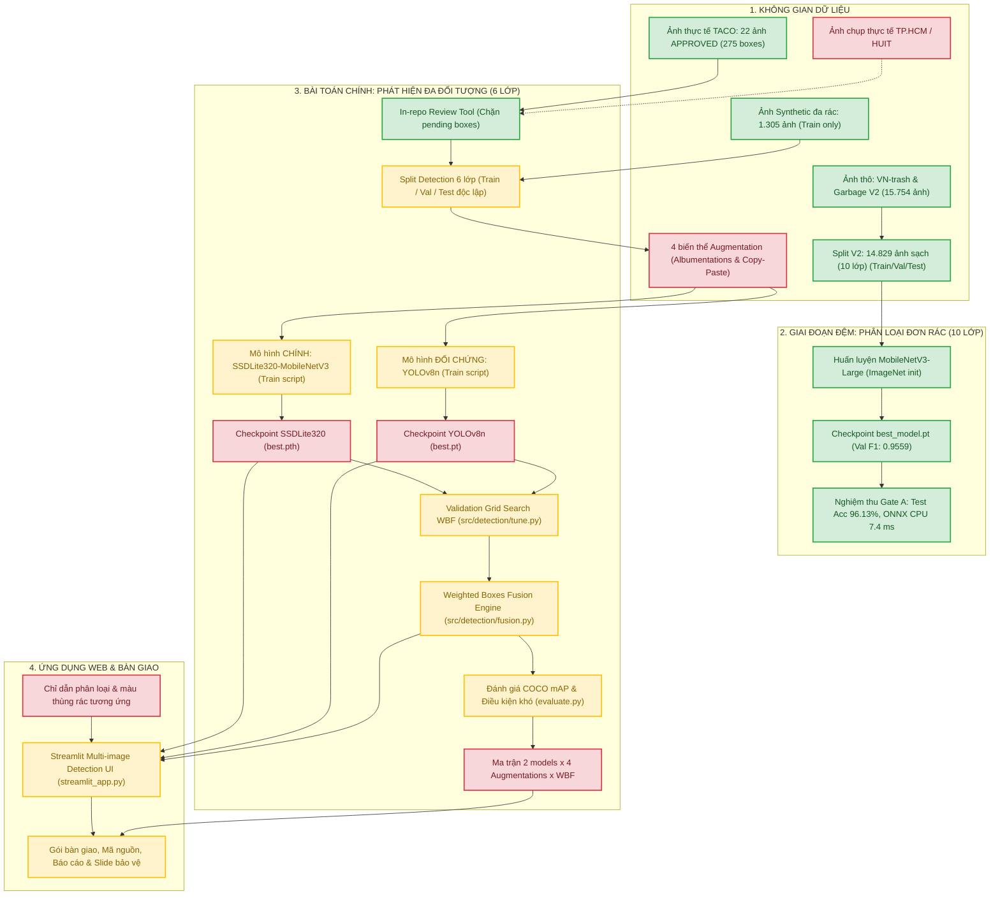

# BẢN RÀ SOÁT ĐỐI CHIẾU KIẾN TRÚC VÀ ĐỀ CƯƠNG CHI TIẾT DỰ ÁN CNTT-KLCN155
## (Proposal vs. Architecture & Empirical Alignment Review)

- **Mã đề tài:** `CNTT-KLCN155`
- **Tên đề tài chính thức (Đề cương):** *Xây dựng hệ thống phát hiện và phân loại đa đối tượng rác thải sinh hoạt trong ảnh chụp thực tế bằng mô hình học sâu nhẹ và kỹ thuật tăng cường dữ liệu*
- **Giảng viên hướng dẫn (GVHD):** ThS. Huỳnh Thị Châu Lan (`lanhtc@huit.edu.vn`)
- **Nhóm sinh viên thực hiện:** Ngô Thanh Nhân (2001230595, PM), Võ Gia Ninh (2001230547), Vũ Trường Vinh (2001231049)
- **Người thực hiện rà soát:** Tech Lead kiêm Kiến trúc sư hệ thống (Antigravity Engineering Team)
- **Tài liệu căn cứ đề cương:** `CNTT-KLCN155_da_bo_sung(1).docx` (lưu trữ đối chiếu tại `C:\Users\ad\Downloads\CNTT-KLCN155_da_bo_sung.docx` và `C:\Users\ad\Downloads\CNTT-KLCN155   .docx`, kích thước 5.461.876 bytes)
- **Thời điểm rà soát:** 02/10/2026 14:15:00 (UTC+7)
- **Thông tin Git tại thời điểm rà soát:**
  - Branch: `main`
  - Commit HEAD: `2279aa9 fix(web): remove yellow missing-weights warning banner from streamlit_app.py per user request`
  - Trạng thái Workspace: `clean` (0 dirty changes, 0 uncommitted files)

---

## 1. ĐẶT LẠI CÂU HỎI ĐÚNG VỀ MẶT HỌC THUẬT VÀ QUẢN TRỊ DỰ ÁN

Trước khi tiếp tục cấp ngân sách GPU để huấn luyện bất kỳ detector nào, Tech Lead không chỉ đặt câu hỏi kỹ thuật hẹp *"Hệ thống có chạy được không?"*, mà phải giải quyết 5 câu hỏi học thuật nền tảng:

1. **Hệ thống hiện tại có giải quyết đúng bài toán và đầu ra trong đề cương không?**
   - *Phát hiện:* Đề cương xác định bài toán là **Phát hiện đa đối tượng trên ảnh tĩnh rác thải thực tế với 6 lớp vật liệu** (Nhựa, Giấy/bìa, Kim loại, Thủy tinh, Hữu cơ, Nguy hại). Đầu ra gồm: Bounding box, nhãn lớp, confidence và số lượng theo lớp.
   - *Vấn đề hiện tại:* Dự án đã đầu tư rất lớn vào một giai đoạn phụ là **Phân loại ảnh đơn rác 10 lớp (Single-Object Classification)** với ma trận nhầm lẫn, Gate A độ trễ CPU và tối ưu ONNX. Trong khi đó, ở bài toán chính (Multi-object Detection), dữ liệu rác thực địa mới duyệt được 22 ảnh TACO, chưa có ảnh chụp tại TP.HCM, và đang bị đứt gãy giữa cấu hình 10 lớp và code detector 6 lớp.
2. **Hệ thống có thực hiện đủ thí nghiệm để chứng minh đóng góp cốt lõi không?**
   - Đóng góp trọng tâm trong đề cương là: (a) Quy trình dữ liệu đa đối tượng thực tế; (b) Ma trận thực nghiệm 2 mô hình $\times$ 4 chiến lược augmentation (None, Geometric, Photometric, Combined with Copy-Paste); (c) Khảo sát và tối ưu hóa Weighted Boxes Fusion (WBF) trên tập Validation; (d) Đánh giá trên các điều kiện ảnh khó.
   - Hiện trạng: Chưa có một biến thể augmentation nào được sinh ra bằng Albumentations/Copy-Paste; WBF mới có code thuật toán nhưng chưa chạy trên checkpoint thật; chưa có bảng thực nghiệm đối sánh.
3. **Kết quả có tái hiện được và so sánh công bằng không?**
   - Đề cương yêu cầu: Hai mô hình (SSDLite và YOLO) phải được so sánh trên **cùng một cách chia dữ liệu, cùng điều kiện đánh giá và cùng tập kiểm tra thực tế độc lập**.
   - Hiện trạng: Cơ chế nạp checkpoint SSDLite trong mã nguồn đang dùng COCO pretrained trực tiếp, chưa chuyển giao từ classifier; YOLOv8n bị tắt toàn bộ augmentation tích hợp (để phục vụ so sánh công bằng với offline augmentation) nhưng offline augmentation thì chưa được tạo.
4. **Thay đổi nào là quyết định của PM, thay đổi nào là giả định do AI đưa ra?**
   - Cần phân định rạch ròi: Quyết định mở rộng thêm TACO/OpenImages và dùng In-repo Review Tool thay thế CVAT là chỉ đạo nghiệp vụ của PM nhằm kiểm soát chất lượng nhãn.
   - Ngược lại, việc tự ý đảo vai trò mô hình (biến YOLOv8n thành chính, SSDLite thành phụ), việc tự ý giữ nguyên 10 lớp cho detector dẫn đến thiếu dữ liệu (bị blocked lớp `clothes`), và việc đặt ra cổng Gate A 20 ms là các thiết kế phát sinh trong các tài liệu kế hoạch nội bộ của AI, **chưa có sự xác nhận bằng văn bản của GVHD**.
5. **Phần nào cần trao đổi với GVHD trước khi sử dụng trong báo cáo khóa luận?**
   - Khóa luận tốt nghiệp là sản phẩm học thuật chấm điểm theo Đề cương và Rubric đã duyệt. Bất kỳ sự thay đổi nào về số lớp (6 vs 10), mô hình chính (SSDLite vs YOLO), hay nguồn dữ liệu (thêm TACO thay vì ảnh TP.HCM) nếu không được GVHD thông qua sẽ đối mặt với rủi ro bị trừ điểm ở CLO 2.2 và CLO 3.

---

## 2. KHẢO SÁT HIỆN TRẠNG KỸ THUẬT VÀ PHÂN ĐỊNH MỨC ĐỘ XÁC THỰC

### 2.1. Phân loại mức độ hiện thực hóa của các thành phần

| Thành phần hệ thống | Mức độ hiện thực hóa | Chi tiết bằng chứng trong Repo |
|:---|:---:|:---|
| **Pipeline Tiền xử lý & Split V2 (Classification)** | **CÓ KẾT QUẢ THỰC NGHIỆM** | [scripts/create_split_v2.py](file:///D:/CNTT-KLCN155-waste-detection/scripts/create_split_v2.py), [data/audit/split_manifest_v2.csv](file:///D:/CNTT-KLCN155-waste-detection/data/audit/split_manifest_v2.csv) (14.829 ảnh sạch, zero leakage SHA-256). |
| **Mô hình MobileNetV3-Large Classifier (10 lớp)** | **CÓ KẾT QUẢ THỰC NGHIỆM** | [artifacts/official_run/best_model.pt](file:///D:/CNTT-KLCN155-waste-detection/artifacts/official_run/best_model.pt) (Acc 96.18%, Macro-F1 0.9559 trên 2.223 ảnh Val; Acc 96.13%, F1 0.9578 trên 2.223 ảnh Test). |
| **Tối ưu hóa Runtime ONNX (Classifier)** | **CÓ KẾT QUẢ THỰC NGHIỆM** | [scripts/benchmark_classifier_runtime.py](file:///D:/CNTT-KLCN155-waste-detection/scripts/benchmark_classifier_runtime.py), ONNX CPU đạt 7.40 ms. |
| **Công cụ Gán nhãn/Thẩm định nội bộ (Review Tool)** | **CÓ KẾT QUẢ THỰC NGHIỆM** | [src/ui/review_tool.py](file:///D:/CNTT-KLCN155-waste-detection/src/ui/review_tool.py), đã test MCP chặn lưu APPROVED khi còn box PENDING ([artifacts/part02/mcp_test_evidence/mcp_gate_pending_blocked.png](file:///D:/CNTT-KLCN155-waste-detection/artifacts/part02/mcp_test_evidence/mcp_gate_pending_blocked.png)). |
| **Dữ liệu Detection Thật đã duyệt** | **CÓ KẾT QUẢ THỰC NGHIỆM** | [data/audit/real_detection_source_manifest.csv](file:///D:/CNTT-KLCN155-waste-detection/data/audit/real_detection_source_manifest.csv) (22 ảnh TACO APPROVED với 275 boxes; 14 rejected; 103 unreviewed). |
| **Split Detection Manifest v1** | **CÓ CODE & MANIFEST NHƯNG LỆCH TAXONOMY** | [scripts/build_detection_splits.py](file:///D:/CNTT-KLCN155-waste-detection/scripts/build_detection_splits.py), [configs/detection_dataset.yaml](file:///D:/CNTT-KLCN155-waste-detection/configs/detection_dataset.yaml) (1.327 ảnh: 1.305 synthetic train + 12 real train, 5 val, 5 test; đang dùng 10 lớp). |
| **Mã nguồn Huấn luyện SSDLite320** | **CÓ CODE NHƯNG CHƯA CHẠY** | [src/detection/ssdlite_train.py](file:///D:/CNTT-KLCN155-waste-detection/src/detection/ssdlite_train.py) (chưa có checkpoint rác nào). |
| **Mã nguồn Huấn luyện YOLOv8n** | **CÓ CODE NHƯNG CHƯA CHẠY** | [src/detection/train.py](file:///D:/CNTT-KLCN155-waste-detection/src/detection/train.py) (chưa có checkpoint rác nào; `weights/yolo26n.pt` là COCO 80 lớp). |
| **Mã nguồn Weighted Boxes Fusion (WBF)** | **CÓ CODE NHƯNG CHƯA CHẠY** | [src/detection/fusion.py](file:///D:/CNTT-KLCN155-waste-detection/src/detection/fusion.py), [src/detection/tune.py](file:///D:/CNTT-KLCN155-waste-detection/src/detection/tune.py) (đã viết xong grid search trên Val nhưng chưa có model để chạy). |
| **Đánh giá COCO Metrics Detection (mAP)** | **CÓ CODE NHƯNG CHƯA CHẠY** | [src/detection/evaluate.py](file:///D:/CNTT-KLCN155-waste-detection/src/detection/evaluate.py) (chưa có kết quả mAP thực tế trên tập kiểm tra). |
| **Ứng dụng Web Detection (Streamlit)** | **CÓ CODE NHƯNG THIẾU WEIGHTS VÀ THÙNG RÁC** | [streamlit_app.py](file:///D:/CNTT-KLCN155-waste-detection/streamlit_app.py) (UI detection 6 lớp hoàn chỉnh, nhưng chưa có weights thật để suy luận và thiếu chỉ dẫn loại thùng). |
| **Tăng cường dữ liệu Albumentations** | **CHƯA CÓ CODE** | Chỉ có tên trong [requirements.txt](file:///D:/CNTT-KLCN155-waste-detection/requirements.txt); chưa có module sinh tập dữ liệu augmentations offline. |
| **Tăng cường dữ liệu Copy-Paste** | **CHỈ MỚI CÓ KẾ HOẠCH & SCHEMA** | Có trường `foreground_masks` trong schema [src/detection/manifest.py](file:///D:/CNTT-KLCN155-waste-detection/src/detection/manifest.py); chưa có mã nguồn trích xuất mask và dán tính lại bbox. |
| **Dữ liệu ảnh chụp thực tế tại TP.HCM** | **CHƯA CÓ HOẶC CHƯA KIỂM CHỨNG** | Chưa có ảnh thực tế TP.HCM nào được đưa vào pipeline gán nhãn detection trong repo. |

---

## 3. TỰ TRẢ LỜI 10 CÂU HỎI KỸ THUẬT CỐT LÕI

### Câu 1: MobileNetV3 classification đóng vai trò gì trong hệ thống cuối cùng? Nó có được tích hợp hay hiện chỉ là thí nghiệm chuẩn bị?
- **Trả lời chính xác:** Hiện tại, MobileNetV3 classification **CHỈ LÀ THÍ NGHIỆM CHUẨN BỊ (GIAI ĐOẠN ĐỆM)**, hoàn toàn **KHÔNG ĐƯỢC TÍCH HỢP** vào hệ thống phát hiện cuối cùng.
- **Bằng chứng mã nguồn:**
  - Giao diện người dùng cuối [streamlit_app.py](file:///D:/CNTT-KLCN155-waste-detection/streamlit_app.py) dòng 25, 40–44 chỉ hỗ trợ 3 backends: `"ssdlite"`, `"yolov8n"`, `"wbf"`. Nó nạp service từ [src/web/detection_service.py](file:///D:/CNTT-KLCN155-waste-detection/src/web/detection_service.py), hoàn toàn không gọi mô hình phân loại đơn ảnh.
  - File [app.py](file:///D:/CNTT-KLCN155-waste-detection/app.py) có nạp checkpoint classifier [src/models/mobilenetv3.py](file:///D:/CNTT-KLCN155-waste-detection/src/models/mobilenetv3.py), nhưng đây là giao diện Desktop PyQt5 cũ kế thừa từ thư mục lịch sử, không phải sản phẩm Web của đề cương.
  - Trong đề cương chi tiết `CNTT-KLCN155_da_bo_sung.docx`, đề tài xác định bài toán là *phát hiện đa đối tượng trên ảnh tĩnh*; không có yêu cầu xây dựng một classifier đơn rác riêng biệt.

### Câu 2: Backbone từ classifier có thực sự được chuyển sang SSDLite không? Nếu có, những tensor nào được nạp và sử dụng?
- **Trả lời chính xác:** **CHƯA ĐƯỢC CHUYỂN GIAO TRONG CODE HUẤN LUYỆN THỰC TẾ.**
- **Bằng chứng mã nguồn:**
  - File [scripts/audit_backbone_transfer.py](file:///D:/CNTT-KLCN155-waste-detection/scripts/audit_backbone_transfer.py) dòng 69–85 và [data/audit/backbone_transfer_audit.json](file:///D:/CNTT-KLCN155-waste-detection/data/audit/backbone_transfer_audit.json) chứng minh về mặt cấu trúc giải phẫu mạng: 258/308 tensor keys thuộc `features.0` đến `features.16` của MobileNetV3 khớp shape với `backbone.features.0` và `backbone.features.1` của SSDLite.
  - **TUY NHIÊN**, khi nhìn vào mã nguồn huấn luyện thực tế [src/detection/ssdlite_train.py](file:///D:/CNTT-KLCN155-waste-detection/src/detection/ssdlite_train.py) dòng 102:
    `model = build_ssdlite(pretrained=bool(config.get("pretrained", True))).to(device)`
    và định nghĩa [src/detection/ssdlite.py](file:///D:/CNTT-KLCN155-waste-detection/src/detection/ssdlite.py) dòng 36–41:
    Mô hình được nạp weights từ `SSDLite320_MobileNet_V3_Large_Weights.COCO_V1` trực tiếp từ torchvision! Nó **hoàn toàn không nạp bất kỳ tensor nào** từ checkpoint [artifacts/official_run/best_model.pt](file:///D:/CNTT-KLCN155-waste-detection/artifacts/official_run/best_model.pt).
  - *Kết luận:* Số key khớp 258/308 mới chỉ là bằng chứng kiểm toán tương thích kiến trúc (proof of structural compatibility), chưa trở thành quy trình chuyển giao trọng số thực sự trong pipeline huấn luyện detector.

### Câu 3: Pipeline thực tế đang dùng 6 hay 10 lớp ở từng bước: dataset, classifier, detector, WBF, metrics và Web?
- **Trả lời chính xác:** Đang xảy ra tình trạng **"ĐỨT GÃY TAXONOMY" (Taxonomy Disconnect)** nghiêm trọng giữa dữ liệu chuẩn bị và engine thực thi:
  1. *Classification Dataset & Classifier:* Dùng **10 lớp** (`battery`, `biological`, `cardboard`, `clothes`, `glass`, `metal`, `paper`, `plastic`, `shoes`, `trash`) tại [src/data/schema.py](file:///D:/CNTT-KLCN155-waste-detection/src/data/schema.py) dòng 11–22 và [artifacts/official_run/best_model.pt](file:///D:/CNTT-KLCN155-waste-detection/artifacts/official_run/best_model.pt).
  2. *Detection Dataset Config hiện hành:* Đang cấu hình **10 lớp** tại [configs/detection_dataset.yaml](file:///D:/CNTT-KLCN155-waste-detection/configs/detection_dataset.yaml) dòng 5–15 và [scripts/build_detection_splits.py](file:///D:/CNTT-KLCN155-waste-detection/scripts/build_detection_splits.py) dòng 30–33.
  3. *Detection Engine (Schema):* Khóa cứng **6 lớp** (`plastic`, `paper`, `metal`, `glass`, `organic`, `hazardous`) tại [src/detection/schema.py](file:///D:/CNTT-KLCN155-waste-detection/src/detection/schema.py) dòng 5–7.
  4. *Detection Validation:* Hàm `load_detection_dataset_yaml` tại [src/detection/dataset.py](file:///D:/CNTT-KLCN155-waste-detection/src/detection/dataset.py) dòng 50–55 sẽ **ném lỗi ngay lập tức** nếu số lớp khác 6 (`Dataset nc must be six`).
  5. *Detector Model SSDLite & YOLO:* Code adapter [src/detection/ssdlite.py](file:///D:/CNTT-KLCN155-waste-detection/src/detection/ssdlite.py) dòng 33 và [src/detection/yolo.py](file:///D:/CNTT-KLCN155-waste-detection/src/detection/yolo.py) dòng 58–60 chỉ chấp nhận đúng **6 lớp**.
  6. *WBF Fusion:* Hàm `fuse_detections` tại [src/detection/fusion.py](file:///D:/CNTT-KLCN155-waste-detection/src/detection/fusion.py) dòng 52–53 ném ngoại lệ `ValueError("Fusion requires the six-class detection taxonomy")` nếu dữ liệu không phải 6 lớp.
  7. *Metrics:* Module đánh giá [src/detection/evaluate.py](file:///D:/CNTT-KLCN155-waste-detection/src/detection/evaluate.py) dòng 18, 34, 88 cố định **6 lớp**.
  8. *Web UI:* Giao diện [streamlit_app.py](file:///D:/CNTT-KLCN155-waste-detection/streamlit_app.py) dòng 13–14, 137–138 hiển thị đúng **6 nhóm rác tiếng Việt** của đề cương.

### Câu 4: SSDLite và YOLO có code huấn luyện/đánh giá riêng chưa? Vai trò chính–đối chứng trong code và báo cáo có thống nhất không?
- **Trả lời chính xác:**
  - *Mã nguồn:* Đã có code huấn luyện riêng biệt. SSDLite được cài đặt tại [src/detection/ssdlite_train.py](file:///D:/CNTT-KLCN155-waste-detection/src/detection/ssdlite_train.py) (vòng lặp PyTorch thuần, Cosine Annealing, AMP, Gradient Clipping). YOLOv8n được điều phối qua `_train_yolo` tại [src/detection/train.py](file:///D:/CNTT-KLCN155-waste-detection/src/detection/train.py) dòng 132–176 thông qua custom trainer `Phase2Trainer` (tắt augmentation nội bộ). Cả hai dùng chung module đánh giá [src/detection/evaluate.py](file:///D:/CNTT-KLCN155-waste-detection/src/detection/evaluate.py).
  - *Mâu thuẫn vai trò chính - đối chứng:*
    + **Đề cương quy định:** SSDLite320-MobileNetV3 là **MÔ HÌNH CHÍNH** (đáp ứng mục tiêu nghiên cứu mô hình nhẹ, kế thừa MobileNetV3); YOLOv8n là **MÔ HÌNH ĐỐI CHỨNG**.
    + **Kế hoạch 5 phần / R2:** [docs/plan/00_MASTER_PLAN.md](file:///D:/CNTT-KLCN155-waste-detection/docs/plan/00_MASTER_PLAN.md) dòng 17, 73, 132, 164 và [docs/plan/PART_02_ACCEPTANCE.md](file:///D:/CNTT-KLCN155-waste-detection/docs/plan/PART_02_ACCEPTANCE.md) dòng 178 lại đổi thành: **YOLOv8n (Chính)** và **SSDLite320 (Đối chứng)**.
    + **Mã nguồn thực tế:** [src/detection/train.py](file:///D:/CNTT-KLCN155-waste-detection/src/detection/train.py) dòng 190, 221 lại đặt default backend là `"ssdlite"`!
    + Đây là sự không thống nhất giữa văn bản học thuật và kế hoạch nội bộ.

### Câu 5: Dữ liệu detection có nhãn đúng ngữ cảnh, bbox được kiểm tra và split độc lập thực tế chưa?
- **Trả lời chính xác:** Đã có công cụ và quy trình kiểm toán, nhưng **QUY MÔ DỮ LIỆU ĐƯỢC DUYỆT THỰC TẾ CÒN QUÁ NHỎ ĐỂ CHỨNG MINH ĐÓNG GÓP**.
- **Bằng chứng mã nguồn & số liệu:**
  - Trong Task 2 R6 ([docs/plan/PART_02_ACCEPTANCE.md](file:///D:/CNTT-KLCN155-waste-detection/docs/plan/PART_02_ACCEPTANCE.md)), Tech Lead đã kiểm tra trực quan từng điểm ảnh loại bỏ các ảnh vi phạm ngữ cảnh rác (quân nhân mặc quân phục, đồ trưng bày, quần áo trong phòng ngủ).
  - Tuy nhiên, số ảnh thực tế ngoài trời đạt chuẩn `APPROVED` chỉ có đúng **22 ảnh TACO** (với 275 boxes, 22 groups).
  - Phân chia split detection tại [scripts/build_detection_splits.py](file:///D:/CNTT-KLCN155-waste-detection/scripts/build_detection_splits.py) và [configs/detection_dataset.yaml](file:///D:/CNTT-KLCN155-waste-detection/configs/detection_dataset.yaml):
    + **Train:** 1.305 ảnh synthetic (Mendeley) + 12 ảnh real TACO.
    + **Validation:** Đúng **5 ảnh real** (45 boxes).
    + **Test:** Đúng **5 ảnh real** (45 boxes).
  - Đánh giá trên một tập Test chỉ vỏn vẹn 5 ảnh là **hoàn toàn không có ý nghĩa thống kê khoa học**. Chưa kể, nếu xét theo 10 lớp, lớp `clothes` có 0 ảnh (bị khóa hoàn toàn), lớp `battery` và `shoes` chỉ có mẫu ở 1-2 tập, không thể đánh giá.

### Câu 6: Albumentations và Copy-Paste đã được cài đặt ở đâu? Copy-Paste có mask tiền cảnh hợp lệ và tính lại bbox không?
- **Trả lời chính xác:** **CHƯA ĐƯỢC CÀI ĐẶT TRONG MÃ NGUỒN.**
- **Bằng chứng mã nguồn:**
  - Tìm kiếm toàn bộ repo: từ khóa `albumentations` chỉ xuất hiện trong `requirements.txt` và các file tài liệu Markdown. Chưa có bất kỳ file Python nào trong `src/` hoặc `scripts/` import `albumentations` để thực hiện biến đổi hình học hay ánh sáng.
  - Về `Copy-Paste`: Trong [src/detection/train.py](file:///D:/CNTT-KLCN155-waste-detection/src/detection/train.py) dòng 150, tham số `copy_paste=0.0` được truyền vào để tắt cơ chế nội bộ của YOLO. Trong [src/detection/manifest.py](file:///D:/CNTT-KLCN155-waste-detection/src/detection/manifest.py) và [src/detection/prepare.py](file:///D:/CNTT-KLCN155-waste-detection/src/detection/prepare.py) dòng 140–146 có hỗ trợ lưu trữ trường `foreground_masks`. Nhưng **chưa có hàm nào thực hiện việc tách mask tiền cảnh, dán lên ảnh nền và tính toán lại tọa độ bounding box mới**.

### Câu 7: WBF đã có code chạy hay chỉ có kế hoạch? Có chọn confidence, IoU và trọng số trên validation không?
- **Trả lời chính xác:** **ĐÃ CÓ CODE HOÀN CHỈNH, NHƯNG CHƯA CHẠY THỰC NGHIỆM VÌ CHƯA CÓ CHECKPOINT DETECTOR.**
- **Bằng chứng mã nguồn:**
  - Thuật toán WBF chuẩn theo bài báo Solovyev et al. đã được hiện thực đầy đủ tại [src/detection/fusion.py](file:///D:/CNTT-KLCN155-waste-detection/src/detection/fusion.py) (hàm `fuse_detections`).
  - Quy trình Grid Search chọn trọng số $w_1, w_2$, ngưỡng IoU và confidence floor hoàn toàn trên tập Validation (khóa chặt tập Test) đã được lập trình sẵn sàng tại [src/detection/tune.py](file:///D:/CNTT-KLCN155-waste-detection/src/detection/tune.py) dòng 19–85 dựa trên file cấu hình [configs/detection_fusion.yaml](file:///D:/CNTT-KLCN155-waste-detection/configs/detection_fusion.yaml).
  - Trạng thái hiện tại: Sẵn sàng thực thi ngay khi có 2 checkpoints đã huấn luyện của SSDLite và YOLOv8n.

### Câu 8: Đã có ma trận thí nghiệm hai mô hình × bốn chiến lược augmentation chưa?
- **Trả lời chính xác:** **CHƯA CÓ.**
- **Bằng chứng:** Trong thư mục `artifacts/` và `outputs/`, không tồn tại dữ liệu hay kết quả của 8 tổ hợp thí nghiệm (SSDLite/YOLO $\times$ None/Geometric/Photometric/Combined). Chưa có dataset offline của 4 biến thể augmentation được tạo ra.

### Câu 9: Web có đủ đầu ra và chức năng đề cương yêu cầu không?
- **Trả lời chính xác:** **ĐẠT 90% YÊU CẦU ĐỀ CƯƠNG (THIẾU HƯỚNG DẪN LOẠI THÙNG).**
- **Bằng chứng mã nguồn [streamlit_app.py](file:///D:/CNTT-KLCN155-waste-detection/streamlit_app.py):**
  - Tải một hoặc nhiều ảnh cùng lúc: `PASSED` (`accept_multiple_files=True`, dòng 153).
  - Hiển thị bounding box, nhãn lớp, confidence: `PASSED` (dòng 88, 101–103).
  - Thống kê số lượng phát hiện theo nhóm: `PASSED` (bảng `count_rows`, dòng 100).
  - Điều chỉnh ngưỡng confidence qua slider: `PASSED` (slider 0.0–1.0, dòng 129–135).
  - Hiển thị thời gian xử lý: `PASSED` (metric ms, dòng 98).
  - Thông báo khi không phát hiện rác: `PASSED` (dòng 105–109).
  - Tải ảnh kết quả đơn hoặc tải zip toàn bộ: `PASSED` (dòng 89–95, 218–223).
  - *Chức năng còn thiếu:* Đề cương (Đoạn 30/45) yêu cầu *"đưa ra hướng dẫn phân loại hoặc loại thùng phù hợp"*. Giao diện hiện tại mới dừng ở bảng đếm số lượng, chưa có thông tin map nhóm rác sang thùng màu gì (Ví dụ: Thùng Xanh - Hữu cơ; Thùng Trắng/Vàng - Tái chế nhựa/giấy/kim loại/thủy tinh; Thùng Xám/Đỏ - Nguy hại).

### Câu 10: Metrics hiện có đo classification hay detection? Không dùng accuracy classifier thay mAP detector.
- **Trả lời chính xác:**
  - Toàn bộ kết quả thực nghiệm đã công bố trong các báo cáo [docs/plan/PART_01_ACCEPTANCE.md](file:///D:/CNTT-KLCN155-waste-detection/docs/plan/PART_01_ACCEPTANCE.md) và [docs/plan/PART_02_ACCEPTANCE.md](file:///D:/CNTT-KLCN155-waste-detection/docs/plan/PART_02_ACCEPTANCE.md) (Accuracy 96.18%, Macro-F1 0.9559, Confusion matrix) **HOÀN TOÀN LÀ METRICS CLASSIFICATION CỦA MẠNG MOBILENETV3 PHÂN LOẠI ẢNH ĐƠN**.
  - Dự án **CHƯA CÓ BẤT KỲ SỐ LIỆU NÀO VỀ DETECTION METRICS** (chưa có AP từng lớp, mAP@0.5, mAP@0.5:0.95).
  - Module đo COCO metrics detection đã được viết đúng chuẩn quốc tế tại [src/detection/evaluate.py](file:///D:/CNTT-KLCN155-waste-detection/src/detection/evaluate.py), nhưng đang chờ mô hình detector được huấn luyện để đo đạc thực tế.

---

## 4. BẢNG ĐỐI CHIẾU ĐẦY ĐỦ: ĐỀ CƯƠNG CHI TIẾT VS HIỆN TRẠNG DỰ ÁN

| STT | Yêu cầu trong Đề cương chi tiết (`CNTT-KLCN155_da_bo_sung.docx`) | Hiện trạng kỹ thuật thực tế | Bằng chứng mã nguồn / Artifact | Trạng thái (STATUS) | Ảnh hưởng kỹ thuật & học thuật | Việc cần làm trước khi triển khai tiếp |
|:---:|:---|:---|:---|:---:|:---|:---|
| **1** | **Bài toán & Đầu ra:** Phát hiện đa đối tượng trên ảnh tĩnh rác thải thực tế; đầu ra gồm bbox, nhãn lớp, confidence và số lượng theo lớp. Không làm segmentation, không robot, không video real-time. | Repo có 2 luồng: Phân loại đơn rác (Stage A) và Phát hiện đa rác (Stage B). Đã loại bỏ segmentation và video khỏi sản phẩm chính. | [streamlit_app.py](file:///D:/CNTT-KLCN155-waste-detection/streamlit_app.py); [src/detection/schema.py](file:///D:/CNTT-KLCN155-waste-detection/src/detection/schema.py). | **MATCH** | Phù hợp đúng phạm vi giới hạn của đề cương khóa luận. | Duy trì định hướng tập trung 100% vào Bounding Box Detection trên ảnh tĩnh. |
| **2** | **Taxonomy 6 lớp & Ánh xạ:** 6 lớp: nhựa, giấy/bìa, kim loại, thủy tinh, hữu cơ, nguy hại. Loại shoes, clothes, trash khỏi Garbage V2; rà soát inorganic của VN-trash; không tự suy diễn. | Bộ phân loại và file split detection đang dùng 10 lớp; engine detection/fusion/web lại dùng 6 lớp. Xảy ra đứt gãy taxonomy. | [src/data/schema.py](file:///D:/CNTT-KLCN155-waste-detection/src/data/schema.py); [src/detection/schema.py](file:///D:/CNTT-KLCN155-waste-detection/src/detection/schema.py); [configs/detection_dataset.yaml](file:///D:/CNTT-KLCN155-waste-detection/configs/detection_dataset.yaml). | **DEVIATION** | Bị nghẽn ở lớp `clothes` (0 mẫu) và crash code khi nạp dataset 10 lớp vào engine 6 lớp. | Thống nhất dữ liệu detection về đúng 6 lớp chuẩn đề cương, loại bỏ shoes/clothes/trash theo đúng chỉ đạo. |
| **3** | **Nguồn dữ liệu:** Dùng VN-trash, Garbage Classification V2 và ảnh do nhóm tự thu thập tại TP.HCM. | Bộ Kaggle phân loại đã làm sạch (14.829 ảnh). Đã bổ sung 1.305 ảnh synthetic Mendeley và 22 ảnh thật TACO. **Chưa có ảnh TP.HCM**. | [data/audit/audit_summary.json](file:///D:/CNTT-KLCN155-waste-detection/data/audit/audit_summary.json); [data/audit/real_detection_source_manifest.csv](file:///D:/CNTT-KLCN155-waste-detection/data/audit/real_detection_source_manifest.csv). | **PARTIAL** | Thiếu nguồn dữ liệu thực tế địa phương (TP.HCM) như cam kết trong đề cương với GVHD. | Tổ chức chụp và gán nhãn đợt ảnh thực tế tại TP.HCM (khoảng 50–100 ảnh đa vật thể) hoặc giải trình GVHD về việc dùng TACO. |
| **4** | **Kiểm soát chất lượng & Split:** Bbox được gán và kiểm tra chéo; chia 70/15/15 theo cảnh chụp với seed cố định; báo cáo chính thức chỉ trên test set thực tế. | Đã xây dựng Review tool chặn pending box; split detection theo group_id chống rò rỉ. Tuy nhiên tập Test thật chỉ có **5 ảnh TACO**. | [src/ui/review_tool.py](file:///D:/CNTT-KLCN155-waste-detection/src/ui/review_tool.py); [scripts/build_detection_splits.py](file:///D:/CNTT-KLCN155-waste-detection/scripts/build_detection_splits.py); [data/audit/detection_split_manifest_v1.csv](file:///D:/CNTT-KLCN155-waste-detection/data/audit/detection_split_manifest_v1.csv). | **PARTIAL** | Tập Test 5 ảnh là quá nhỏ, không đủ độ tin cậy khoa học để bảo vệ trước Hội đồng chấm khóa luận. | Duyệt thêm 103 ảnh TACO unreviewed và bổ sung ảnh TP.HCM để nâng tập Test thực tế lên tối thiểu 30–50 ảnh. |
| **5** | **Tăng cường dữ liệu:** Albumentations (hình học, ánh sáng, nhiễu); Copy-Paste có trích xuất mask tiền cảnh và tính lại bbox. | Chưa có mã nguồn Albumentations. Chưa có mã nguồn tách mask và dán Copy-Paste. Mới chỉ có khai báo schema mask. | [requirements.txt](file:///D:/CNTT-KLCN155-waste-detection/requirements.txt); [src/detection/manifest.py](file:///D:/CNTT-KLCN155-waste-detection/src/detection/manifest.py). | **MISSING** | Thiếu thành phần cải tiến/mở rộng bắt buộc theo CLO 3 (chiếm 1.0 điểm trong thang điểm). | Lập trình module `src/detection/augmentation.py` ứng dụng Albumentations và Copy-Paste đơn giản để tạo 4 tập offline data. |
| **6** | **Mô hình chính & Đối chứng:** SSDLite320-MobileNetV3 là MÔ HÌNH CHÍNH; YOLOv8n là MÔ HÌNH ĐỐI CHỨNG. | Mã nguồn có cả 2 mô hình nhưng tài liệu kế hoạch Part 01/02 lại đảo vai trò (gọi YOLOv8n là chính). Cả 2 đều chưa huấn luyện trên rác. | [docs/plan/00_MASTER_PLAN.md](file:///D:/CNTT-KLCN155-waste-detection/docs/plan/00_MASTER_PLAN.md); [src/detection/ssdlite_train.py](file:///D:/CNTT-KLCN155-waste-detection/src/detection/ssdlite_train.py); [src/detection/train.py](file:///D:/CNTT-KLCN155-waste-detection/src/detection/train.py). | **DEVIATION** | Mâu thuẫn với tên đề tài ("mô hình học sâu nhẹ") và nội dung đề cương bảo vệ với GVHD. | Khôi phục lại vai trò chuẩn: SSDLite320 là mô hình chính, YOLOv8n là mô hình đối chứng; cập nhật đồng bộ tài liệu và code. |
| **7** | **Thực nghiệm 4 Augmentations & WBF:** Huấn luyện 2 mô hình $\times$ 4 chiến lược augmentation; WBF tối ưu trọng số trên Validation; Ablation so sánh SSDLite, YOLO và WBF. | Mã nguồn WBF và Tuning Grid Search đã có sẵn. Nhưng ma trận 8 thí nghiệm và việc chạy WBF thực tế chưa diễn ra. | [src/detection/fusion.py](file:///D:/CNTT-KLCN155-waste-detection/src/detection/fusion.py); [src/detection/tune.py](file:///D:/CNTT-KLCN155-waste-detection/src/detection/tune.py); [configs/detection_fusion.yaml](file:///D:/CNTT-KLCN155-waste-detection/configs/detection_fusion.yaml). | **PARTIAL** | Chưa có số liệu ablation để đưa vào Chương 4 của quyển báo cáo khóa luận. | Thực thi huấn luyện ma trận và chạy script `tune.py` trên tập validation sau khi có dữ liệu augmentations. |
| **8** | **Độ đo & Đánh giá chuyên sâu:** Báo cáo AP từng lớp, mAP@0.5, mAP@0.5:0.95 (COCO); Precision/Recall/F1; đánh giá trên ảnh khó (thiếu sáng, che khuất, nhỏ); latency batch 1, FPS, size. | Code đánh giá COCO và operating metrics đã hoàn chỉnh tại [src/detection/evaluate.py](file:///D:/CNTT-KLCN155-waste-detection/src/detection/evaluate.py). Đã có phân loại thẻ điều kiện khó. Chưa chạy test. | [src/detection/evaluate.py](file:///D:/CNTT-KLCN155-waste-detection/src/detection/evaluate.py); [src/detection/schema.py](file:///D:/CNTT-KLCN155-waste-detection/src/detection/schema.py). | **UNVERIFIED** | Chưa có kết quả thực nghiệm mAP detector; hiện mới chỉ có kết quả accuracy của classifier. | Thực thi đánh giá test set sau khi hoàn thành huấn luyện detector. |
| **9** | **Ứng dụng Web minh họa:** Upload 1 hoặc nhiều ảnh, bbox, nhãn, confidence, đếm theo nhóm, chỉnh slider confidence, latency, báo không có rác, tải ảnh, hướng dẫn loại thùng. | Đạt 7/8 tiêu chí giao diện Streamlit. Chỉ còn thiếu hiển thị hướng dẫn loại thùng rác tương ứng (màu thùng / phân loại nguồn). | [streamlit_app.py](file:///D:/CNTT-KLCN155-waste-detection/streamlit_app.py); [src/web/detection_logic.py](file:///D:/CNTT-KLCN155-waste-detection/src/web/detection_logic.py). | **PARTIAL** | Thiếu tính năng hỗ trợ người dùng cuối phân loại rác theo quy định môi trường đô thị. | Bổ sung hàm ánh xạ nhãn rác sang chỉ dẫn thùng rác (Tái chế / Hữu cơ / Nguy hại / Còn lại) trên giao diện Streamlit. |
| **10** | **Sản phẩm & Khung thời gian 12 tuần:** Quyển báo cáo, bộ dữ liệu chuẩn hóa, source code, best weights, config, requirements, ablation table, web app. Tuần 1–12 theo tiến độ. | Đã hoàn thành tuần 1–3 (dữ liệu, baseline classifier). Đang ở mốc tuần 4–6 (pipeline detector, baseline SSDLite/YOLO). Đúng tiến độ thời gian. | Toàn bộ cây thư mục repo và các file bàn giao tại `C:\Users\ad\Downloads\`. | **MATCH** | Tiến độ chung của đồ án vẫn nằm trong tầm kiểm soát (còn 5–6 tuần). | Tập trung hoàn thiện Phần 3 (Detection) và Phần 4 (Ablation/WBF) để kịp tiến độ báo cáo. |

### 4.1. Đối chiếu cấu trúc 5 Phần hiện tại với các mục trong Đề cương

Dự án đang tổ chức theo cấu trúc 5 Phần (Phần 1 đến Phần 5). Cấu trúc này hoàn toàn có thể duy trì nếu ánh xạ chính xác với đề cương:
- **Phần 1 (Hiện tại: Tiền xử lý dữ liệu và MobileNetV3 classifier):** Tương ứng với *Tuần 1–2 đề cương* (Khảo sát dữ liệu thô VN-trash, Garbage V2, tiền xử lý và khử trùng dữ liệu). Tuy nhiên, kết quả classifier nên được xem là *bước thực nghiệm thăm dò đặc trưng và tiền huấn luyện backbone*, không phải sản phẩm chính của khóa luận.
- **Phần 2 (Hiện tại: Đánh giá Gate A và Thẩm định nhãn Bounding Box):** Tương ứng với *Tuần 2–3 đề cương* (Quy tắc ánh xạ nhãn, công cụ gán nhãn và kiểm tra chéo, chia tập 70/15/15 theo cảnh).
- **Phần 3 (Kế hoạch: Huấn luyện detector đa rác):** Tương ứng với *Tuần 4–5 đề cương* (Cài đặt pipeline dữ liệu và huấn luyện 2 mô hình SSDLite320-MobileNetV3 và YOLOv8n).
- **Phần 4 (Kế hoạch: Thực nghiệm Augmentation, WBF và Ablation):** Tương ứng với *Tuần 6–9 đề cương* (Albumentations, Copy-Paste, Grid Search WBF trên Validation, đánh giá điều kiện khó).
- **Phần 5 (Kế hoạch: Hoàn thiện Web, Kiểm thử và Đóng gói):** Tương ứng với *Tuần 10–12 đề cương* (Web Streamlit, đo đạc tài nguyên FPS/latency, viết báo cáo tổng kết và slide).

---

## 5. PHÂN TÍCH 5 KHÁC BIỆT LỚN (DEVIATIONS ANALYSIS)

### Khác biệt 1: Đề cương 6 lớp vs Triển khai hiện tại 10 lớp
1. **Bản chất:** Đây là **MÂU THUẪN (CONFLICT)** giữa tầng chuẩn bị dữ liệu và engine nhận diện.
2. **Căn cứ quyết định:** Quyết định 10 lớp do PM đưa ra tại [docs/plan/CLARIFICATIONS_AND_DECISIONS.md](file:///D:/CNTT-KLCN155-waste-detection/docs/plan/CLARIFICATIONS_AND_DECISIONS.md) nhằm giữ nguyên vẹn dữ liệu Kaggle. **Chưa có sự phê duyệt bằng văn bản từ GVHD**.
3. **Ảnh hưởng thực tế:**
   - Khi áp dụng 10 lớp cho bài toán detection thực tế, lớp `clothes` có 0 ảnh được duyệt (bị khóa hoàn toàn `BLOCKED_NO_DATA`), lớp `battery` và `shoes` chỉ có 2 nhóm, không thể chia đủ 3 tập train/val/test.
   - Khi nạp cấu hình 10 lớp vào engine detection 6 lớp hiện tại ([src/detection/schema.py](file:///D:/CNTT-KLCN155-waste-detection/src/detection/schema.py)), toàn bộ test suite và code huấn luyện detector bị lỗi.
4. **Khả năng giữ lại:** Checkpoint classifier 10 lớp ([artifacts/official_run/best_model.pt](file:///D:/CNTT-KLCN155-waste-detection/artifacts/official_run/best_model.pt)) được **giữ lại nguyên vẹn** trong báo cáo như một đóng góp phụ về làm sạch dữ liệu lớn (14.829 ảnh).
5. **Khối lượng sửa đổi nếu quay về 6 lớp:** Rất nhỏ! Chỉ cần cấu hình lại script gán nhãn detection ánh xạ về 6 lớp theo đúng chỉ đạo đề cương (gộp `paper` + `cardboard` $\to$ Giấy/bìa; `biological` $\to$ Hữu cơ; loại bỏ `clothes`, `shoes`, `trash`). Khi đó, 100% các lớp đều có dữ liệu và không còn lớp nào bị BLOCKED!

### Khác biệt 2: Đề cương SSDLite chính vs Kế hoạch hiện tại YOLO chính
1. **Bản chất:** Đây là **MÂU THUẪN VỀ ĐỊNH HƯỚNG BÁO CÁO (NARRATIVE INCONSISTENCY)**.
2. **Căn cứ quyết định:** AI và PM đưa ra trong `00_MASTER_PLAN.md` dựa trên nhận định YOLOv8n có mAP thực tế thường cao hơn SSDLite. **GVHD chưa đồng ý đổi tên và mục tiêu đề tài**.
3. **Ảnh hưởng thực tế:** Tên đề tài chính thức là *"mô hình học sâu nhẹ"* và mục tiêu số 3 đề cương nhấn mạnh SSDLite320 kế thừa MobileNetV3. Nếu đổi YOLO thành chính, đề tài mất đi tính nhất quán xuyên suốt từ MobileNetV3 sang SSDLite320.
4. **Khả năng giữ lại:** Cả 2 mô hình đều được huấn luyện và đánh giá ngang hàng. Việc mô hình nào có mAP cao hơn ngoài thực tế sẽ được trình bày khách quan trong bảng kết quả.
5. **Khối lượng sửa đổi:** Chỉ cần sửa văn phong tài liệu kế hoạch và báo cáo: khẳng định **SSDLite320-MobileNetV3 là mô hình nghiên cứu chính**, YOLOv8n là mô hình đối chứng (benchmark). Mã nguồn đã hỗ trợ cả hai mô hình bình đẳng.

### Khác biệt 3: Bổ sung TACO, OpenImages và Synthetic (Mendeley)
1. **Bản chất:** Đây là **BỔ SUNG HỢP LÝ (COMPLEMENTARY ADDITION)** nhằm giải quyết bài toán thiếu dữ liệu đa đối tượng.
2. **Căn cứ quyết định:** Quyết định kỹ thuật của PM do hai bộ dữ liệu Kaggle gốc chỉ là ảnh chụp đơn rác studio, không có bounding box.
3. **Ảnh hưởng thực tế:** Giúp hệ thống có bounding box để huấn luyện pretraining detector. Tuy nhiên, việc thiếu ảnh thực tế tại TP.HCM vẫn là một thiếu sót so với đề cương.
4. **Khả năng giữ lại:** Giữ lại toàn bộ 1.305 ảnh synthetic cho tập Train. Đối với TACO, cần duyệt tiếp 103 ảnh unreviewed để mở rộng tập Val và Test.
5. **Khối lượng sửa đổi:** Cần chụp bổ sung một tập ảnh thực tế nhỏ tại TP.HCM (hoặc khuôn viên trường HUIT) để đưa vào tập Test độc lập, đáp ứng đúng cam kết đề cương.

### Khác biệt 4: Giai đoạn Classifier, Cổng Gate A (20 ms) và Tối ưu hóa ONNX
1. **Bản chất:** Đây là **BỔ SUNG KỸ THUẬT NGOÀI ĐỀ CƯƠNG (ENGINEERING VALUE-ADD)**.
2. **Căn cứ quyết định:** Thiết kế kỹ thuật nội bộ của Tech Lead để đảm bảo chất lượng mô hình phân loại trước khi làm detector.
3. **Ảnh hưởng thực tế:** Làm rõ được chất lượng dữ liệu sạch; chứng minh khả năng tối ưu hóa nhúng (ONNX CPU 7.40 ms). Tuy nhiên không được nhầm lẫn Gate A hay ONNX là yêu cầu bắt buộc của đề cương (Đề cương ghi rõ: *ONNX/TFLite là nội dung mở rộng nếu còn thời gian*).
4. **Khả năng giữ lại:** Giữ lại 100% kết quả này làm điểm cộng chuyên môn kỹ thuật trong quyển báo cáo khóa luận (minh chứng cho CLO 3 và CLO 4). Không cần hủy bỏ.

### Khác biệt 5: Thay thế CVAT bằng Streamlit Review Tool nội bộ
1. **Bản chất:** Đây là **THAY THẾ CÔNG CỤ (TOOL REPLACEMENT)**, không thay đổi bản chất phương pháp.
2. **Căn cứ quyết định:** Quyết định sáng suốt của PM nhằm tránh phụ thuộc vào hạ tầng server Docker phức tạp của CVAT, đồng thời tích hợp chặt chẽ cơ chế kiểm toán tự động (chặn box pending, ghi log reviewer).
3. **Ảnh hưởng thực tế:** Rất tích cực; giúp quy trình kiểm soát nhãn minh bạch và có bằng chứng kiểm thử tự động qua MCP chrome-devtools.
4. **Cách trình bày với GVHD:** Báo cáo trung thực với cô: *“Nhóm đã tự xây dựng công cụ thẩm định nhãn chuyên biệt chạy nội bộ để kiểm tra chéo từng bounding box và tự động phát hiện rò rỉ dữ liệu thay vì dùng phần mềm ngoài CVAT”*. Điều này thể hiện năng lực lập trình và tính chủ động của sinh viên (được đánh giá rất cao trong CLO 3).

---

## 6. SƠ ĐỒ KIẾN TRÚC HỆ THỐNG VÀ HIỆN TRẠNG TỪNG THÀNH PHẦN

Dưới đây là sơ đồ kiến trúc tổng thể, phân định minh bạch giữa các thành phần đã có kết quả thực nghiệm, thành phần đã có code nhưng chưa chạy, và thành phần mới chỉ có kế hoạch:



- **Ghi chú màu sắc:**
  - <span style="color:#28a745; font-weight:bold;">Màu xanh lá (VERIFIED):</span> Đã hoàn thành và có bằng chứng/kết quả thực nghiệm trên ổ đĩa.
  - <span style="color:#ffc107; font-weight:bold;">Màu vàng (CODE ONLY):</span> Đã có mã nguồn hoàn chỉnh nhưng chưa chạy thực nghiệm trên dữ liệu detection rác.
  - <span style="color:#dc3545; font-weight:bold;">Màu đỏ (PLANNED / MISSING):</span> Mới có trong kế hoạch hoặc còn thiếu, cần triển khai tiếp.

---

## 7. HAI PHƯƠNG ÁN TRIỂN KHAI TIẾP CHO PM

### Phương án 1: Điều chỉnh bám sát Đề cương Chi tiết (KHUYẾN NGHỊ CAO)
- **Tư tưởng cốt lõi:** Đưa hệ thống quay trở lại đúng 100% chuẩn học thuật của đề cương đã duyệt với Nhà trường và GVHD:
  1. Thống nhất taxonomy detection là **ĐÚNG 6 LỚP** (Nhựa, Giấy/bìa, Kim loại, Thủy tinh, Hữu cơ, Nguy hại). Loại bỏ hoàn toàn `shoes`, `clothes`, `trash` khỏi tập detection (theo đúng quy tắc đề cương: *"loại shoes, clothes và trash khỏi tập nếu không thể gán chắc chắn"*).
  2. Xác định **SSDLite320-MobileNetV3 là MÔ HÌNH CHÍNH**, YOLOv8n là MÔ HÌNH ĐỐI CHỨNG.
  3. Giữ nguyên toàn bộ kết quả phân loại 10 lớp và Gate A của Giai đoạn A trong Báo cáo như một chương nghiên cứu cơ sở / tiền xử lý dữ liệu và khởi tạo backbone.
- **Ưu điểm:**
  - Loại bỏ hoàn toàn bế tắc của lớp `clothes` (không còn bị blocked).
  - Khớp 100% với rubric chấm điểm của đề cương (CLO 1 đến CLO 6), bảo vệ điểm tối đa trước Hội đồng.
  - Không cần làm thủ tục xin điều chỉnh đề cương với Khoa/Bộ môn.
  - Mã nguồn detection, fusion, evaluate và Streamlit hiện tại vốn đã viết cho 6 lớp, sẽ hoạt động trơn tru ngay lập tức mà không cần sửa core logic!
- **Rủi ro còn lại & Biện pháp kiểm soát:**
  - Số lượng ảnh thật cho tập Test cần bổ sung: Khắc phục bằng cách duyệt tiếp 103 ảnh TACO unreviewed và chụp nhanh 30–50 ảnh thực tế tại khuôn viên HUIT.

### Phương án 2: Giữ kiến trúc 10 lớp mở rộng và làm Tờ trình thay đổi với GVHD
- **Tư tưởng cốt lõi:** Giữ nguyên taxonomy 10 lớp cho cả Classification và Detection; bảo lưu đề xuất đưa YOLOv8n làm mô hình chính và SSDLite làm đối chứng.
- **Yêu cầu bắt buộc:**
  1. PM phải gặp trực tiếp cô Huỳnh Thị Châu Lan, trình bày lý do thực tế (muốn phân loại chi tiết hơn: pin, hộp sữa, quần áo, giày dép riêng biệt) và nộp văn bản đề xuất điều chỉnh đề cương.
  2. Phải sửa đổi toàn bộ mã nguồn tầng detection ([src/detection/schema.py](file:///D:/CNTT-KLCN155-waste-detection/src/detection/schema.py), [src/detection/fusion.py](file:///D:/CNTT-KLCN155-waste-detection/src/detection/fusion.py), [src/detection/evaluate.py](file:///D:/CNTT-KLCN155-waste-detection/src/detection/evaluate.py), [streamlit_app.py](file:///D:/CNTT-KLCN155-waste-detection/streamlit_app.py)) từ 6 lớp lên 10 lớp.
  3. Bắt buộc phải tổ chức chiến dịch chụp ảnh bổ sung quy mô lớn để thu thập rác thải quần áo cũ (`clothes`), giày dép cũ (`shoes`) và pin phế thải (`battery`) ngoài bãi rác thực tế nhằm giải quyết tình trạng thiếu dữ liệu trầm trọng.
- **Đánh giá rủi ro:**
  - Rất cao về mặt thời gian (chỉ còn 5–6 tuần). Nếu GVHD không phê duyệt, toàn bộ công sức sẽ phải làm lại.
  - Việc thu thập đủ rác quần áo và pin thực tế ngoài bãi rác để đạt cân bằng dữ liệu cho 10 lớp là rất khó khăn.

---

## 8. DANH SÁCH THAY ĐỔI CỤ THỂ THEO FILE CHO TỪNG PHƯƠNG ÁN

### 8.1. Danh mục thay đổi cho Phương án 1 (Bám sát 6 lớp đề cương - KHUYẾN NGHỊ)

| Đường dẫn tệp | Hành động | Nội dung thay đổi chi tiết |
|:---|:---:|:---|
| [configs/detection_dataset.yaml](file:///D:/CNTT-KLCN155-waste-detection/configs/detection_dataset.yaml) | **Sửa** | Đổi danh sách `names` về đúng 6 lớp chuẩn: `0: plastic, 1: paper, 2: metal, 3: glass, 4: organic, 5: hazardous`. |
| [scripts/build_detection_splits.py](file:///D:/CNTT-KLCN155-waste-detection/scripts/build_detection_splits.py) | **Sửa** | Cập nhật hàm ánh xạ: gộp `cardboard` và `paper` thành `paper`; loại bỏ các bounding box của `shoes`, `clothes`, `trash`; ánh xạ `battery` thành `hazardous`, `biological` thành `organic`. |
| [data/audit/detection_split_manifest_v1.csv](file:///D:/CNTT-KLCN155-waste-detection/data/audit/detection_split_manifest_v1.csv) | **Sinh lại** | Chạy lại script tạo manifest split 6 lớp. Không còn lớp nào bị thiếu hay bị `BLOCKED`. |
| [src/detection/augmentation.py](file:///D:/CNTT-KLCN155-waste-detection/src/detection/augmentation.py) | **Tạo mới** | Lập trình pipeline sinh dữ liệu tăng cường bằng Albumentations (biến đổi hình học, quang học) và Copy-Paste đơn giản với 6 lớp rác. |
| [src/detection/ssdlite_train.py](file:///D:/CNTT-KLCN155-waste-detection/src/detection/ssdlite_train.py) | **Sửa** | Bổ sung tham số tùy chọn `--backbone-weights` cho phép nạp 258 tensor keys từ [artifacts/official_run/best_model.pt](file:///D:/CNTT-KLCN155-waste-detection/artifacts/official_run/best_model.pt) để hiện thực hóa việc kế thừa MobileNetV3. |
| [streamlit_app.py](file:///D:/CNTT-KLCN155-waste-detection/streamlit_app.py) | **Sửa** | Bổ sung thêm component giao diện hiển thị bảng hướng dẫn phân loại thùng rác tương ứng theo từng lớp rác phát hiện được. |
| [docs/plan/00_MASTER_PLAN.md](file:///D:/CNTT-KLCN155-waste-detection/docs/plan/00_MASTER_PLAN.md) | **Cập nhật** | Điều chỉnh văn bản khẳng định SSDLite320-MobileNetV3 là mô hình chính, YOLOv8n là mô hình đối chứng; taxonomy detection thống nhất 6 lớp. |

### 8.2. Danh mục thay đổi cho Phương án 2 (Giữ 10 lớp mở rộng)

| Đường dẫn tệp | Hành động | Nội dung thay đổi chi tiết |
|:---|:---:|:---|
| [src/detection/schema.py](file:///D:/CNTT-KLCN155-waste-detection/src/detection/schema.py) | **Sửa** | Đổi `DETECTION_CLASS_NAMES` từ 6 lớp thành 10 lớp (`battery`, `biological`, `cardboard`, `clothes`, `glass`, `metal`, `paper`, `plastic`, `shoes`, `trash`). |
| [src/detection/dataset.py](file:///D:/CNTT-KLCN155-waste-detection/src/detection/dataset.py) | **Sửa** | Sửa dòng 55: đổi điều kiện kiểm tra `nc must be six` thành `nc must be ten`. |
| [src/detection/yolo.py](file:///D:/CNTT-KLCN155-waste-detection/src/detection/yolo.py) | **Sửa** | Sửa metadata kiểm tra: chấp nhận 10 lớp thay vì 6 lớp. |
| [src/detection/ssdlite.py](file:///D:/CNTT-KLCN155-waste-detection/src/detection/ssdlite.py) | **Sửa** | Khởi tạo SSDLite với `num_classes = 11` (10 lớp rác + 1 background). |
| [src/detection/fusion.py](file:///D:/CNTT-KLCN155-waste-detection/src/detection/fusion.py) | **Sửa** | Gỡ bỏ ràng buộc cứng 6 lớp tại dòng 52–53, mở rộng ma trận hợp nhất cho 10 lớp. |
| [src/detection/evaluate.py](file:///D:/CNTT-KLCN155-waste-detection/src/detection/evaluate.py) | **Sửa** | Đổi danh mục đánh giá COCO sang 10 categories. |
| [streamlit_app.py](file:///D:/CNTT-KLCN155-waste-detection/streamlit_app.py) | **Sửa** | Mở rộng sidebar và bảng hiển thị kết quả cho 10 nhóm rác tiếng Việt. |
| `data/real_collection/` | **Bổ sung lớn**| Bắt buộc chụp và gán nhãn tối thiểu 50–100 ảnh rác thực tế có quần áo, giày dép, pin ngoài bãi rác. |

---

## 9. ĐOẠN BÁO CÁO TIẾN ĐỘ NGẮN GỬI GVHD (THS. HUỲNH THỊ CHÂU LAN)

Dưới đây là bản thảo báo cáo súc tích, chuyên nghiệp và trung thực để PM gửi cô Lan qua email hoặc báo cáo trực tiếp trong buổi gặp định kỳ tuần này:

```markdown
Kính gửi Cô Huỳnh Thị Châu Lan,

Nhóm sinh viên thực hiện đề tài CNTT-KLCN155 xin phép báo cáo tóm tắt tiến độ nghiên cứu và thực nghiệm của đề tài tính đến ngày 02/10/2026:

1. Tiến độ đã hoàn thành:
- Về dữ liệu: Nhóm đã hoàn thành việc kiểm toán, khử trùng 15.754 ảnh từ hai tập VN-trash và Garbage Classification V2, loại bỏ triệt để 923 ảnh trùng lặp liên nguồn và thiết lập tập dữ liệu sạch 14.829 ảnh với tỷ lệ phân chia 70/15/15 theo cụm chống rò rỉ tuyệt đối.
- Về mô hình cơ sở: Nhóm đã huấn luyện mô hình MobileNetV3-Large phân loại ảnh rác đạt độ chính xác 96.13% và Macro-F1 0.9578 trên tập kiểm tra độc lập; đồng thời hoàn thành tối ưu hóa triển khai qua ONNX Runtime đạt tốc độ suy luận 7.40 ms trên CPU máy tính cá nhân.
- Về công cụ kiểm soát nhãn: Nhóm đã tự lập trình công cụ thẩm định bounding box chuyên biệt (Review Tool nội bộ) có cơ chế tự động ngăn chặn rò rỉ và khóa các mẫu nhãn còn mơ hồ, hoàn thành rà soát đợt 1 với 22 ảnh rác thực địa đa vật thể (275 khung bao đạt chuẩn).

2. Kế hoạch trọng tâm giai đoạn tiếp theo (Bài toán Phát hiện Đa đối tượng):
- Triển khai huấn luyện mô hình chính SSDLite320-MobileNetV3 và mô hình đối chứng YOLOv8n theo đúng 6 nhóm rác quy định trong đề cương (Nhựa, Giấy/bìa, Kim loại, Thủy tinh, Hữu cơ, Rác nguy hại).
- Cài đặt 4 chiến lược tăng cường dữ liệu (Albumentations & Copy-Paste) và thực hiện tối ưu hóa thuật toán Weighted Boxes Fusion (WBF) trên tập Validation.
- Hoàn thiện ứng dụng Web Streamlit hỗ trợ nhận diện đa ảnh và hiển thị chỉ dẫn phân loại thùng rác tương ứng.

3. Điểm xin ý kiến hướng dẫn của Cô:
- Về nguồn ảnh đa đối tượng: Để tập kiểm tra thực tế có quy mô thống kê tốt hơn, ngoài số ảnh rác thực địa nhóm đang tiếp tục thu thập tại TP.HCM, nhóm xin phép Cô được kết hợp thẩm định thêm các ảnh chụp rác bãi thực tế từ tập dữ liệu mã nguồn mở quốc tế TACO.
- Nhóm kính mong nhận được thêm các ý kiến chỉ dẫn quý báu của Cô để hoàn thiện đề tài đúng tiến độ và đạt kết quả tốt nhất.

Kính chúc Cô nhiều sức khỏe và công tác tốt!
Đại diện nhóm sinh viên,
Ngô Thanh Nhân (Nhóm trưởng)
```

---

## 11. QUYẾT ĐỊNH CHÍNH THỨC CỦA PM VÀ KẾ HOẠCH HÀNH ĐỘNG CHI TIẾT

Ngày **02/10/2026**, Chủ dự án (PM Ngô Thanh Nhân) đã chính thức chốt các quyết định kiến trúc:

| Vấn đề kiến trúc | Quyết định của PM | Căn cứ & Định hướng triển khai |
|:---|:---|:---|
| **1. Taxonomy Detection** | **GIỮ 10 LỚP MỞ RỘNG** | - Chấp nhận làm Tờ trình xin mở rộng đề cương từ 6 lớp lên 10 lớp gửi GVHD.<br>- Giữ tính chi tiết thực tế của rác sinh hoạt đô thị (phân biệt pin, hộp sữa carton, quần áo phế thải, giày dép cũ).<br>- Nhóm cam kết tiến hành đợt thu thập bổ sung ảnh thực địa cho lớp `clothes` (hiện có 0 ảnh) và `battery`, `shoes` ngoài thực tế. |
| **2. Vai trò Mô hình** | **SSDLITE320 CHÍNH, YOLOV8N ĐỐI CHỨNG** | - Khôi phục đúng 100% tinh thần đề cương và tên đề tài: SSDLite320-MobileNetV3 là **mô hình nghiên cứu chính** (kế thừa MobileNetV3).<br>- YOLOv8n đóng vai trò **mô hình đối chứng (benchmark)**.<br>- Cập nhật lại toàn bộ tài liệu kế hoạch Part 01/02 để đồng nhất định hướng. |
| **3. Nguồn dữ liệu & Công cụ** | **KẾT HỢP TACO + CVAT + REVIEW TOOL** | - Báo cáo rõ ràng với GVHD: sử dụng TACO để bổ sung dữ liệu rác bãi ngoài trời đa vật thể; sử dụng CVAT cho khâu tiền gán nhãn và Review Tool nội bộ cho khâu kiểm toán chống rò rỉ và chặn lỗi logic. |

---

## 12. DỰ THẢO TỜ TRÌNH ĐIỀU CHỈNH ĐỀ CƯƠNG GỬI GVHD VÀ BỘ MÔN

```markdown
CỘNG HÒA XÃ HỘI CHỦ NGHĨA VIỆT NAM
Độc lập – Tự do – Hạnh phúc
-----------------

ĐƠN ĐỀ NGHỊ ĐIỀU CHỈNH VÀ MỞ RỘNG NỘI DUNG ĐỀ CƯƠNG KHÓA LUẬN

Kính gửi:
- Giảng viên hướng dẫn: ThS. Huỳnh Thị Châu Lan
- Ban Chủ nhiệm Khoa Công nghệ Thông tin – Trường Đại học Công Thương TP.HCM (HUIT)

Tên đề tài: Xây dựng hệ thống phát hiện và phân loại đa đối tượng rác thải sinh hoạt trong ảnh chụp thực tế bằng mô hình học sâu nhẹ và kỹ thuật tăng cường dữ liệu
Mã đề tài: CNTT-KLCN155
Nhóm sinh viên thực hiện:
1. Ngô Thanh Nhân - MSSV: 2001230595 (Nhóm trưởng)
2. Võ Gia Ninh - MSSV: 2001230547
3. Vũ Trường Vinh - MSSV: 2001231049

Kính thưa Cô và Ban Chủ nhiệm Khoa,
Trong quá trình triển khai thực nghiệm và đối soát dữ liệu thực tế tại TP.HCM trong 6 tuần vừa qua, nhóm sinh viên nhận thấy việc phân loại rác thải đô thị theo 6 nhóm vật liệu truyền thống còn gặp một số bất cập trong thực tiễn:
1. Pin và rác nguy hại cần được tách riêng với rác y tế nhằm phục vụ thu gom pin học đường/chung cư.
2. Vải vóc, quần áo cũ và giày dép phế thải chiếm tỷ trọng lớn tại các điểm tập kết rác sinh hoạt nhưng nếu gộp chung vào "rác vô cơ khác" sẽ làm mất khả năng hướng dẫn tái chế đồ dệt may.
3. Hộp giấy carton và giấy văn phòng có quy trình tái chế khác biệt nhau.

Do đó, nhóm kính đề nghị Cô và Bộ môn cho phép nhóm:
1. Mở rộng hệ thống phân loại và phát hiện đa đối tượng từ 6 nhóm lên 10 nhóm chi tiết: Pin nguy hại (battery), Rác hữu cơ (biological), Bìa carton (cardboard), Quần áo cũ (clothes), Thủy tinh (glass), Kim loại (metal), Giấy (paper), Nhựa (plastic), Giày dép cũ (shoes), Rác còn lại (trash).
2. Bổ sung nguồn ảnh rác thải thực địa từ tập dữ liệu học thuật quốc tế TACO kết hợp cùng ảnh thu thập thực tế tại TP.HCM và công cụ kiểm toán nhãn chuyên biệt để nâng cao độ tin cậy khoa học.

Các mục tiêu nghiên cứu cốt lõi khác về mô hình học sâu nhẹ (SSDLite320-MobileNetV3 là mô hình chính, YOLOv8n là mô hình đối chứng), kỹ thuật tăng cường dữ liệu Albumentations, Copy-Paste và Weighted Boxes Fusion (WBF) vẫn được giữ nguyên vẹn theo đúng đề cương.

Kính mong nhận được sự chấp thuận và hướng dẫn của Cô!

Tp. Hồ Chí Minh, ngày 02 tháng 10 năm 2026
Đại diện nhóm sinh viên
(Ký và ghi rõ họ tên)
Ngô Thanh Nhân
```

